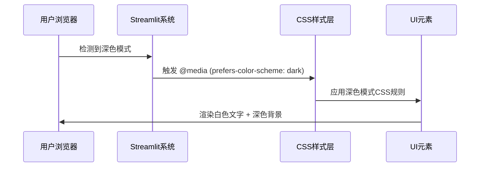

# 设计文档: 深色模式文字颜色修复

## 概述

本功能旨在系统性地修复Streamlit多Agent竞品分析系统在深色模式下的文字颜色显示问题。当前系统在用户浏览器/操作系统启用深色模式(`prefers-color-scheme: dark`)时,部分文本元素仍然显示为黑色,导致在深色背景上无法清晰阅读。

**修复范围**: 覆盖三个主要文件(`app_beautiful.py`, `app.py`, `styles.css`)中的所有文本元素,确保在深色模式下所有文本为白色或浅色。

## 架构

```mermaid
graph TD
    A[Browser/OS Dark Mode] -->|@media prefers-color-scheme: dark| B[CSS Media Query]
    B --> C[app_beautiful.py CSS]
    B --> D[app.py CSS]
    B --> E[styles.css]
    C --> F[Text Color Override]
    D --> F
    E --> F
    F --> G[White Text on Dark Background]
```

## 主要算法/工作流



## 组件和接口

### 组件 1: CSS深色模式媒体查询层

**用途**: 检测并响应用户的深色模式偏好

**接口**:
```css
@media (prefers-color-scheme: dark) {
    /* 深色模式样式规则 */
}
```

**责任**:
- 自动检测浏览器/操作系统深色模式设置
- 在深色模式激活时应用特定CSS规则
- 覆盖默认浅色模式样式

### 组件 2: 文本颜色覆盖系统

**用途**: 确保所有文本元素在深色模式下为白色

**接口**:
```css
@media (prefers-color-scheme: dark) {
    /* 通用文本选择器 */
    .main *, p, span, div, li, label {
        color: #FFFFFF !important;
    }
    
    /* 标题选择器 */
    h1, h2, h3, h4, h5, h6 {
        color: #FFFFFF !important;
    }
    
    /* Streamlit组件选择器 */
    .stMarkdown *, .stText *, [data-testid="stMetricLabel"] {
        color: #FFFFFF !important;
    }
}
```

**责任**:
- 使用`!important`确保优先级最高
- 覆盖所有Streamlit内置组件样式
- 覆盖自定义类和元素样式

### 组件 3: 背景颜色适配系统

**用途**: 在深色模式下调整背景色为深色调

**接口**:
```css
@media (prefers-color-scheme: dark) {
    .main {
        background: linear-gradient(135deg, #1a1a2e 0%, #16213e 50%, #0f3460 100%);
    }
    
    .element-container {
        background: rgba(40, 40, 55, 0.95);
    }
}
```

**责任**:
- 提供与白色文字对比良好的深色背景
- 保持视觉层次和美观性
- 确保可读性符合WCAG标准

## 数据模型

### CSS选择器分类

```typescript
interface CSSSelectors {
  // 通用文本元素
  generic: string[]  // ["*", "p", "span", "div", "li", "label"]
  
  // 标题元素
  headings: string[]  // ["h1", "h2", "h3", "h4", "h5", "h6"]
  
  // Streamlit特定组件
  streamlit: string[]  // [".stMarkdown", ".stText", ".stMetric", etc.]
  
  // 输入元素
  inputs: string[]  // ["input", "textarea", "select"]
  
  // 容器元素
  containers: string[]  // [".main", ".element-container", ".stTabs"]
}
```

**验证规则**:
- 所有选择器必须在深色模式媒体查询内定义
- 文本颜色必须使用 `#FFFFFF` 或浅色值
- 必须使用 `!important` 确保优先级
- 背景颜色必须与文本颜色形成足够对比度 (对比度 >= 4.5:1)

## 核心接口/类型

```typescript
// CSS颜色配置
interface ColorScheme {
  lightMode: {
    text: string       // "#000000"
    background: string // 浅色渐变
  }
  darkMode: {
    text: string       // "#FFFFFF"
    background: string // 深色渐变
  }
}

// CSS规则优先级
enum CSSPriority {
  NORMAL = "normal",
  IMPORTANT = "!important"
}

// 文本元素类型
enum TextElementType {
  HEADING = "heading",
  PARAGRAPH = "paragraph",
  LABEL = "label",
  INPUT = "input",
  METRIC = "metric",
  ALERT = "alert",
  TABLE = "table"
}
```

## 关键函数与形式化规范

### 函数 1: applyDarkModeTextColor()

```css
/* 伪代码表示 */
FUNCTION applyDarkModeTextColor(element: Element)
  INPUT: DOM元素
  OUTPUT: 应用深色模式文字颜色
  
  PRECONDITIONS:
  - element存在于DOM中
  - 深色模式媒体查询已激活
  
  POSTCONDITIONS:
  - element.color === "#FFFFFF"
  - element的所有子元素color === "#FFFFFF"
  - 颜色规则优先级为 !important
  
  ALGORITHM:
  IF element matches text selector THEN
    element.style.color = "#FFFFFF !important"
    FOR EACH child IN element.children DO
      applyDarkModeTextColor(child)
    END FOR
  END IF
END FUNCTION
```

### 函数 2: applyDarkModeBackgrounds()

```css
FUNCTION applyDarkModeBackgrounds(container: Container)
  INPUT: 容器元素
  OUTPUT: 应用深色背景
  
  PRECONDITIONS:
  - container存在于DOM中
  - 深色模式媒体查询已激活
  
  POSTCONDITIONS:
  - container.background使用深色渐变或纯色
  - 背景与白色文字对比度 >= 4.5:1
  
  ALGORITHM:
  IF container matches container selector THEN
    container.style.background = DARK_GRADIENT
    container.style.backgroundColor = DARK_COLOR
  END IF
END FUNCTION
```

### 函数 3: ensureContrastRatio()

```css
FUNCTION ensureContrastRatio(textColor: Color, bgColor: Color): Boolean
  INPUT: 文字颜色, 背景颜色
  OUTPUT: 是否满足对比度要求
  
  PRECONDITIONS:
  - textColor和bgColor为有效的颜色值
  
  POSTCONDITIONS:
  - 返回值表示对比度是否 >= 4.5:1 (WCAG AA标准)
  
  ALGORITHM:
  contrastRatio = calculateContrastRatio(textColor, bgColor)
  RETURN contrastRatio >= 4.5
END FUNCTION
```

## 算法伪代码

### 主要处理算法

```pascal
ALGORITHM fixDarkModeTextColors
INPUT: CSS文件列表 [app_beautiful.py, app.py, styles.css]
OUTPUT: 修复后的CSS规则

BEGIN
  FOR EACH cssFile IN cssFiles DO
    // 步骤1: 定位现有深色模式媒体查询
    darkModeBlock ← findMediaQuery(cssFile, "prefers-color-scheme: dark")
    
    // 步骤2: 收集所有文本选择器
    textSelectors ← collectTextSelectors()
    
    // 步骤3: 为每个选择器添加白色文字规则
    FOR EACH selector IN textSelectors DO
      IF NOT existsInDarkMode(darkModeBlock, selector) THEN
        addRule(darkModeBlock, selector, "color: #FFFFFF !important")
      ELSE IF ruleNeedsUpdate(darkModeBlock, selector) THEN
        updateRule(darkModeBlock, selector, "color: #FFFFFF !important")
      END IF
    END FOR
    
    // 步骤4: 验证所有规则
    FOR EACH rule IN darkModeBlock.rules DO
      IF isTextRule(rule) THEN
        ASSERT rule.color IN ["#FFFFFF", "#EEEEEE", "#DDDDDD"]
        ASSERT rule.priority === "!important"
      END IF
    END FOR
    
    // 步骤5: 保存修改
    saveCSSFile(cssFile, darkModeBlock)
  END FOR
  
  RETURN SUCCESS
END
```

**前置条件**:
- 所有CSS文件可读写
- 已存在`@media (prefers-color-scheme: dark)`媒体查询块
- 浅色模式样式已正确配置

**后置条件**:
- 所有文本元素在深色模式下颜色为白色
- 所有规则使用`!important`优先级
- 对比度满足WCAG AA标准 (>= 4.5:1)

**循环不变式**:
- 已处理的选择器都有正确的深色模式规则
- 所有文本颜色规则都使用`#FFFFFF`
- 优先级始终为`!important`

### 选择器收集算法

```pascal
ALGORITHM collectTextSelectors
INPUT: 无
OUTPUT: 文本选择器列表

BEGIN
  selectors ← []
  
  // 通用文本元素
  selectors.append(["*", "p", "span", "div", "li", "label", "strong", "small"])
  
  // 标题元素
  selectors.append(["h1", "h2", "h3", "h4", "h5", "h6"])
  selectors.append(["h1 *", "h2 *", "h3 *", "h4 *", "h5 *", "h6 *"])
  
  // Streamlit组件
  selectors.append([
    ".stMarkdown", ".stMarkdown *",
    ".stText", ".stText *",
    ".stMarkdown p", ".stMarkdown li", ".stMarkdown span"
  ])
  
  // 指标组件
  selectors.append([
    "[data-testid='stMetricLabel']",
    "[data-testid='stMetricValue']",
    "[data-testid='stMetricDelta']"
  ])
  
  // 输入元素
  selectors.append(["input", "textarea", "select", "label"])
  
  // Tab组件
  selectors.append([
    ".stTabs [data-baseweb='tab']",
    ".stTabs [aria-selected='true']"
  ])
  
  // 按钮
  selectors.append([".stButton > button"])
  
  // 数据表格
  selectors.append([
    ".dataframe", ".dataframe *",
    ".dataframe th", ".dataframe td"
  ])
  
  // Alert框
  selectors.append([
    ".stAlert", ".stAlert *",
    ".stInfo", ".stInfo *",
    ".stSuccess", ".stSuccess *",
    ".stWarning", ".stWarning *",
    ".stError", ".stError *"
  ])
  
  // 容器
  selectors.append([
    ".main *",
    ".element-container *",
    ".progress-container *",
    ".footer *"
  ])
  
  // 自定义类
  selectors.append([
    ".main-title", ".main-title *",
    ".subtitle", ".subtitle *",
    ".info-card", ".info-card *",
    ".feature-badge",
    ".success-box", ".success-box *"
  ])
  
  RETURN selectors
END
```

**前置条件**:
- 无

**后置条件**:
- 返回覆盖所有文本元素类型的选择器列表
- 包含通配符选择器和特定类选择器
- 包含Streamlit内置组件选择器

## 示例用法

### 示例 1: 修复标题颜色

```css
/* 修复前 - 浅色模式有样式,深色模式缺失 */
h1 {
    color: #000000 !important;
    font-weight: 900 !important;
}

/* 修复后 - 添加深色模式规则 */
h1 {
    color: #000000 !important;
    font-weight: 900 !important;
}

@media (prefers-color-scheme: dark) {
    h1 {
        color: #FFFFFF !important;
        font-weight: 900 !important;
    }
}
```

### 示例 2: 修复Streamlit组件

```css
/* 修复前 - 深色模式下可能被覆盖 */
.stMarkdown p {
    color: #000000 !important;
}

/* 修复后 - 确保深色模式优先级 */
.stMarkdown p {
    color: #000000 !important;
}

@media (prefers-color-scheme: dark) {
    .stMarkdown, .stMarkdown *, .stMarkdown p {
        color: #FFFFFF !important;
        font-weight: 600 !important;
    }
}
```

### 示例 3: 完整工作流

```css
/* 浅色模式 - 默认样式 */
.main * {
    color: #000000 !important;
    font-weight: 600 !important;
}

h1, h2, h3 {
    color: #000000 !important;
}

.stButton > button {
    color: #000000 !important;
}

/* 深色模式 - 完整覆盖 */
@media (prefers-color-scheme: dark) {
    /* 主容器背景 */
    .main {
        background: linear-gradient(135deg, #1a1a2e 0%, #16213e 50%, #0f3460 100%);
    }
    
    /* 所有文本元素 */
    .main * {
        color: #FFFFFF !important;
        font-weight: 600 !important;
    }
    
    /* 标题 */
    h1, h2, h3, h4, h5, h6 {
        color: #FFFFFF !important;
    }
    
    /* Streamlit组件 */
    .stMarkdown, .stText, .stButton > button {
        color: #FFFFFF !important;
    }
    
    /* 输入框 */
    input, textarea, select {
        color: #FFFFFF !important;
        background-color: rgba(50, 50, 70, 0.95) !important;
    }
    
    /* 数据表格 */
    .dataframe, .dataframe * {
        color: #FFFFFF !important;
    }
}
```

## 正确性属性

*属性是应该在系统的所有有效执行中保持真实的特征或行为——本质上,是关于系统应该做什么的形式化陈述。属性作为人类可读规范和机器可验证正确性保证之间的桥梁。*

### 属性 1: 深色模式文本颜色一致性

*对于任何* 文本元素(标题、段落、标签、按钮文字、表格文字等),当深色模式激活时,该元素的`color`CSS属性应该等于`#FFFFFF`或浅色值(>=`#DDDDDD`)

**验证: 需求 1.1, 1.2, 1.3, 1.4, 1.5, 1.6, 1.7**

### 属性 2: CSS优先级保证

*对于任何* 深色模式下的文本颜色规则,该规则必须使用`!important`声明符,以确保不被其他规则覆盖

**验证: 需求 2.1, 2.2, 2.3, 2.4**

### 属性 3: 对比度合规性

*对于任何* 文本元素和其背景容器,在深色模式下,文本颜色与背景颜色的对比度应该 >= 4.5:1 (符合WCAG AA标准)

**验证: 需求 3.1, 3.2, 3.3, 3.4**

### 属性 4: 选择器全覆盖

*对于任何* Streamlit应用中出现的文本元素类型(通用元素、Streamlit组件、自定义类),必须存在对应的深色模式CSS选择器规则

**验证: 需求 4.1, 4.2, 4.3, 4.4, 4.5, 4.6, 4.7, 4.8, 4.9**

### 属性 5: 媒体查询响应性

*对于任何* 浏览器/操作系统深色模式状态变化,CSS`@media (prefers-color-scheme: dark)`媒体查询应该立即生效,无需页面刷新

**验证: 需求 5.1, 5.2, 5.3, 5.4**

### 属性 6: 浅色模式不受影响

*对于任何* 在深色模式下修改的CSS规则,不应影响浅色模式下的样式表现,即浅色模式文本仍为黑色

**验证: 需求 6.1, 6.2, 6.3, 6.4**

### 属性 7: 多文件一致性

*对于任何* CSS规则类型(文本颜色、背景颜色、优先级),在`app_beautiful.py`、`app.py`和`styles.css`三个文件中的深色模式实现应该保持一致

**验证: 需求 7.1, 7.2, 7.3, 7.4, 7.5**

## 错误处理

### 错误场景 1: CSS选择器优先级冲突

**条件**: 深色模式规则被其他更高优先级规则覆盖
**响应**: 使用`!important`声明符强制优先级
**恢复**: 审查所有CSS规则,确保深色模式规则优先级最高

### 错误场景 2: 对比度不足

**条件**: 白色文字在浅色背景上对比度不足
**响应**: 调整背景颜色为更深的色调
**恢复**: 使用对比度检查工具验证所有颜色组合

### 错误场景 3: 选择器遗漏

**条件**: 某些动态生成的元素未被选择器覆盖
**响应**: 添加通配符选择器(如`.main *`)确保全覆盖
**恢复**: 手动测试所有页面和组件

## 测试策略

### 单元测试方法

测试特定CSS选择器和规则的正确性:
- 验证深色模式媒体查询存在
- 验证关键选择器的颜色值
- 验证`!important`声明符存在

### 属性测试方法

**属性测试库**: 不适用(CSS样式测试通常不使用属性测试)

本功能主要通过**视觉回归测试**和**手动测试**验证:
- 在浅色模式和深色模式下截图对比
- 使用浏览器开发者工具检查计算样式
- 使用对比度检查工具验证WCAG合规性

### 集成测试方法

- 在实际Streamlit应用中启用深色模式
- 遍历所有页面和组件
- 验证所有文本元素可读性
- 测试深色模式切换的响应性

## 性能考虑

- CSS媒体查询是浏览器原生支持,性能影响极小
- 使用通配符选择器(如`*`)可能略微增加CSS解析时间,但影响可忽略
- 深色模式切换应该是即时的,无需JavaScript干预

## 安全考虑

- 无直接安全风险
- CSS注入风险:确保所有CSS规则来自可信源
- 可访问性:确保颜色对比度符合WCAG标准,支持视力障碍用户

## 依赖

- **Streamlit**: Web应用框架 (>=1.0.0)
- **浏览器支持**: 需要支持CSS媒体查询`prefers-color-scheme` (现代浏览器均支持)
- **无外部CSS库依赖**: 纯CSS实现
