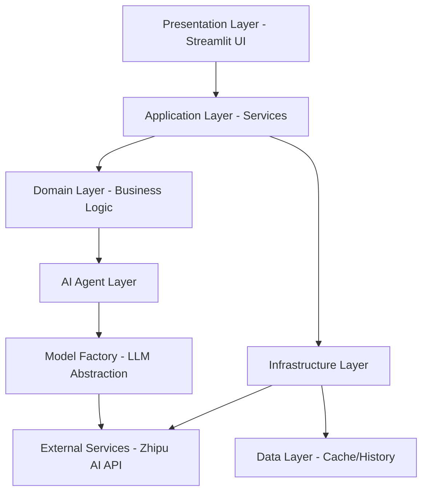

# Design Document: Enterprise Architecture Refactoring for Competitor Analysis System

## Overview

This document outlines the enterprise-level architecture refactoring for the existing competitor analysis AI application. The refactoring transforms the current script-style codebase into a professionally structured, maintainable, testable, and scalable system while preserving all existing functionality. The new architecture follows SOLID principles, implements high cohesion and low coupling, and includes comprehensive error handling, dependency injection, and proper separation of concerns.

## Architecture



## Main Algorithm/Workflow

```mermaid
sequenceDiagram
    participant UI as Streamlit UI
    participant AS as AnalysisService
    participant PA as PipelineOrchestrator
    participant DA as DiscoveryAgent
    participant CA as CollectorAgent
    participant AA as AnalysisAgents
    participant SA as StrategyAgent
    participant LLM as LLMClient
    
    UI->>AS: analyze(keyword)
    AS->>PA: execute_pipeline(keyword)
    PA->>DA: discover_competitors(keyword)
    DA->>LLM: call_llm(prompt)
    LLM-->>DA: competitors_list
    PA->>CA: collect_data(competitors)
    CA->>LLM: call_llm(prompt)
    LLM-->>CA: detailed_data
    PA->>AA: analyze_features/pricing/market
    AA->>LLM: call_llm(prompt)
    LLM-->>AA: analysis_results
    PA->>SA: generate_strategy(results)
    SA->>LLM: call_llm(prompt)
    LLM-->>SA: strategy
    PA-->>AS: complete_results
    AS-->>UI: formatted_results


## Core Interfaces/Types

### Configuration Management

```python
from dataclasses import dataclass
from typing import Optional
from pathlib import Path

@dataclass
class AppConfig:
    """Application configuration"""
    api_key: str
    model_name: str
    cache_enabled: bool
    cache_expiry_seconds: int
    log_level: str
    max_concurrent_requests: int

@dataclass
class PathConfig:
    """Path configuration"""
    base_dir: Path
    cache_dir: Path
    logs_dir: Path
    reports_dir: Path
    history_dir: Path
```

### LLM Client Interface

```python
from abc import ABC, abstractmethod
from typing import Dict, Any, List

class ILLMClient(ABC):
    """Interface for LLM client implementations"""
    
    @abstractmethod
    def chat_completion(
        self,
        messages: List[Dict[str, str]],
        temperature: float = 0.7,
        max_tokens: Optional[int] = None
    ) -> str:
        """Execute chat completion"""
        pass
    
    @abstractmethod
    def is_available(self) -> bool:
        """Check if LLM service is available"""
        pass
```

### Agent Interface

```python
from abc import ABC, abstractmethod
from typing import Generic, TypeVar, Any

TInput = TypeVar('TInput')
TOutput = TypeVar('TOutput')

class IAgent(ABC, Generic[TInput, TOutput]):
    """Base interface for all agents"""
    
    @abstractmethod
    def execute(self, input_data: TInput) -> TOutput:
        """Execute agent logic"""
        pass
    
    @abstractmethod
    def validate_input(self, input_data: TInput) -> bool:
        """Validate input data"""
        pass
    
    @abstractmethod
    def get_agent_name(self) -> str:
        """Get agent identifier"""
        pass
```

### Service Interfaces

```python
from typing import Protocol
from pandas import DataFrame

class IAnalysisService(Protocol):
    """Analysis service interface"""
    
    def analyze_competitors(self, keyword: str) -> Dict[str, Any]:
        """Execute full competitor analysis"""
        ...

class ICacheService(Protocol):
    """Cache service interface"""
    
    def get(self, key: str) -> Optional[Any]:
        """Get cached value"""
        ...
    
    def set(self, key: str, value: Any, ttl: Optional[int] = None) -> bool:
        """Set cached value"""
        ...
    
    def clear(self) -> int:
        """Clear all cache"""
        ...
```


## Key Functions with Formal Specifications

### Function 1: LLMClient.chat_completion()

```python
def chat_completion(
    self,
    messages: List[Dict[str, str]],
    temperature: float = 0.7,
    max_tokens: Optional[int] = None,
    retry_count: int = 3
) -> str:
    """Execute LLM chat completion with retry mechanism"""
```

**Preconditions:**
- `messages` is non-empty list of message dictionaries
- Each message contains 'role' and 'content' keys
- `temperature` is in range [0.0, 1.0]
- `retry_count` is positive integer ≥ 1
- LLM client is properly initialized with valid API key

**Postconditions:**
- Returns non-empty string response from LLM
- If all retries fail, raises LLMException with descriptive error
- Request metrics are logged (duration, token count)
- No side effects on input parameters

**Loop Invariants:**
- Retry counter decrements on each failed attempt
- Last exception is preserved for error reporting
- Connection timeout increases exponentially per retry

### Function 2: BaseAgent.execute()

```python
def execute(self, input_data: TInput) -> TOutput:
    """Execute agent logic with validation and error handling"""
```

**Preconditions:**
- `input_data` is non-null and type-correct for agent
- Agent is properly initialized with required dependencies
- LLM client is available and functional

**Postconditions:**
- Returns valid output conforming to TOutput type
- Input validation is performed before execution
- Execution is logged with start/end timestamps
- On failure, raises AgentExecutionException with context

**Loop Invariants:** N/A (no loops in base execute)

### Function 3: AnalysisService.analyze_competitors()

```python
def analyze_competitors(self, keyword: str) -> Dict[str, Any]:
    """Execute complete competitor analysis pipeline"""
```

**Preconditions:**
- `keyword` is non-empty string (after strip)
- All required agents are registered and initialized
- Cache service and logger are available

**Postconditions:**
- Returns dictionary with all analysis results
- Result contains keys: competitors, data, product_analysis, pricing_analysis, market_analysis, strategy
- All DataFrame results are non-empty
- Analysis is cached with keyword-based key
- Execution time is logged and returned in metadata

**Loop Invariants:**
- For each agent in pipeline: Previous agent results are available to current agent
- Failed agent execution stops pipeline and logs error

### Function 4: CacheService.get_or_compute()

```python
def get_or_compute(
    self,
    key: str,
    compute_fn: Callable[[], T],
    ttl: Optional[int] = None
) -> T:
    """Get cached value or compute and cache if missing"""
```

**Preconditions:**
- `key` is non-empty string
- `compute_fn` is callable that returns value of type T
- `ttl` is None or positive integer

**Postconditions:**
- Returns cached value if exists and not expired
- If cache miss, executes compute_fn and caches result
- Cache expiry is set according to ttl parameter
- Computation errors are propagated to caller

**Loop Invariants:** N/A

### Function 5: PipelineOrchestrator.execute_pipeline()

```python
def execute_pipeline(self, keyword: str) -> Dict[str, Any]:
    """Orchestrate agent execution in correct sequence"""
```

**Preconditions:**
- `keyword` is non-empty string
- All agents (discovery, collector, analysis, strategy) are registered
- Agent execution order is defined

**Postconditions:**
- All agents execute in correct sequence
- Each agent receives validated output from previous agent
- Pipeline execution is atomic (all succeed or all fail)
- Partial results are logged even on failure

**Loop Invariants:**
- For agent execution loop: All previously executed agents completed successfully
- Current agent input is validated output from previous agent
- Pipeline state remains consistent throughout execution


## Algorithmic Pseudocode

### Main Analysis Pipeline Algorithm

```python
ALGORITHM execute_competitor_analysis(keyword)
INPUT: keyword of type String
OUTPUT: analysis_results of type Dictionary

BEGIN
  ASSERT keyword is not empty AND keyword is stripped
  
  # Step 1: Check cache
  cache_key ← generate_cache_key(keyword)
  cached_results ← cache_service.get(cache_key)
  
  IF cached_results is not null THEN
    log("Cache hit for keyword: " + keyword)
    RETURN cached_results
  END IF
  
  # Step 2: Initialize pipeline
  pipeline ← create_pipeline_orchestrator()
  results ← empty_dictionary()
  
  # Step 3: Execute agents in sequence
  TRY
    # Discovery phase
    competitors ← pipeline.discovery_agent.execute(keyword)
    ASSERT competitors.length >= 3 AND competitors.length <= 10
    results["competitors"] ← competitors
    
    # Collection phase
    detailed_data ← pipeline.collector_agent.execute(competitors)
    ASSERT detailed_data is valid DataFrame
    ASSERT detailed_data.rows = competitors.length
    results["data"] ← detailed_data
    
    # Analysis phase (parallel execution possible)
    product_analysis ← pipeline.product_agent.execute(detailed_data)
    pricing_analysis ← pipeline.pricing_agent.execute(detailed_data)
    market_analysis ← pipeline.market_agent.execute(detailed_data)
    
    ASSERT product_analysis is non-empty DataFrame
    ASSERT pricing_analysis contains required keys
    ASSERT market_analysis contains required keys
    
    results["product_analysis"] ← product_analysis
    results["pricing_analysis"] ← pricing_analysis
    results["market_analysis"] ← market_analysis
    
    # Strategy phase
    strategy_input ← create_strategy_input(product_analysis, pricing_analysis, market_analysis)
    strategy ← pipeline.strategy_agent.execute(strategy_input)
    ASSERT strategy is non-empty string
    results["strategy"] ← strategy
    
  CATCH AgentExecutionException as e
    log_error("Agent execution failed: " + e.message)
    THROW AnalysisException("Pipeline failed at: " + e.agent_name, e)
  END TRY
  
  # Step 4: Cache results
  cache_service.set(cache_key, results, ttl=3600)
  
  # Step 5: Return results
  ASSERT all required keys present in results
  RETURN results
END
```

**Preconditions:**
- keyword is non-empty string
- All agents are initialized and functional
- Cache service is available

**Postconditions:**
- Returns complete analysis results dictionary
- Results are cached for future requests
- All agent executions are logged
- On failure, meaningful exception is raised

**Loop Invariants:**
- Each agent receives validated output from previous agent
- Partial results are stored in results dictionary
- Pipeline state remains consistent

### LLM Call with Retry Algorithm

```python
ALGORITHM call_llm_with_retry(messages, temperature, max_retries)
INPUT: messages (List of Dict), temperature (Float), max_retries (Integer)
OUTPUT: response_text (String)

BEGIN
  ASSERT messages is not empty
  ASSERT temperature >= 0.0 AND temperature <= 1.0
  ASSERT max_retries >= 1
  
  retry_count ← 0
  last_exception ← null
  base_delay ← 1.0  # seconds
  
  WHILE retry_count < max_retries DO
    ASSERT retry_count >= 0
    
    TRY
      # Prepare request
      request ← create_llm_request(messages, temperature)
      
      # Set timeout based on retry count
      timeout ← base_delay * (2 ^ retry_count)
      
      # Execute API call
      start_time ← current_timestamp()
      response ← llm_api.chat_completion(request, timeout)
      end_time ← current_timestamp()
      
      # Validate response
      IF response is null OR response.content is empty THEN
        THROW LLMEmptyResponseException()
      END IF
      
      # Log success metrics
      duration ← end_time - start_time
      log_metrics("LLM call succeeded", duration, response.token_count)
      
      RETURN response.content
      
    CATCH NetworkException as e
      last_exception ← e
      retry_count ← retry_count + 1
      log_warning("Network error, retry " + retry_count + "/" + max_retries)
      
      IF retry_count < max_retries THEN
        delay ← base_delay * (2 ^ retry_count)
        sleep(delay)
      END IF
      
    CATCH APIException as e
      last_exception ← e
      log_error("API error: " + e.message)
      THROW LLMException("API call failed", e)
    END TRY
  END WHILE
  
  # All retries exhausted
  log_error("All retries exhausted for LLM call")
  THROW LLMException("Maximum retries exceeded", last_exception)
END
```

**Preconditions:**
- messages contains valid message dictionaries
- temperature in valid range [0.0, 1.0]
- max_retries is positive integer
- LLM API client is initialized

**Postconditions:**
- Returns non-empty response string on success
- Raises LLMException with context on failure
- All attempts are logged with metrics
- Exponential backoff applied between retries

**Loop Invariants:**
- retry_count is in range [0, max_retries]
- last_exception contains most recent error
- Each retry has longer timeout than previous


### Cache Get-or-Compute Algorithm

```python
ALGORITHM get_or_compute_cached(key, compute_function, ttl)
INPUT: key (String), compute_function (Callable), ttl (Integer or null)
OUTPUT: cached_or_computed_value (Any)

BEGIN
  ASSERT key is not empty
  ASSERT compute_function is callable
  ASSERT ttl is null OR ttl > 0
  
  # Step 1: Try to get from cache
  cached_value ← cache_storage.get(key)
  
  IF cached_value is not null THEN
    # Check if expired
    IF current_timestamp() - cached_value.timestamp <= cached_value.ttl THEN
      log("Cache hit: " + key)
      RETURN cached_value.data
    ELSE
      log("Cache expired: " + key)
      cache_storage.delete(key)
    END IF
  END IF
  
  # Step 2: Cache miss - compute value
  log("Cache miss: " + key)
  
  TRY
    computed_value ← compute_function()
    
    # Validate computed value
    IF computed_value is null THEN
      log_warning("Compute function returned null for key: " + key)
      RETURN null
    END IF
    
  CATCH ComputeException as e
    log_error("Compute function failed for key: " + key)
    THROW CacheComputeException("Failed to compute value", e)
  END TRY
  
  # Step 3: Store in cache
  cache_entry ← create_cache_entry(
    key=key,
    data=computed_value,
    timestamp=current_timestamp(),
    ttl=ttl OR default_ttl
  )
  
  success ← cache_storage.set(cache_entry)
  
  IF success THEN
    log("Cached new value: " + key)
  ELSE
    log_warning("Failed to cache value: " + key)
  END IF
  
  RETURN computed_value
END
```

**Preconditions:**
- key is non-empty string
- compute_function is callable and returns valid value
- ttl is null or positive integer
- Cache storage is initialized and available

**Postconditions:**
- Returns cached value if valid and not expired
- Returns computed value if cache miss
- New computed value is stored in cache
- All cache operations are logged

**Loop Invariants:** N/A

### Agent Validation Algorithm

```python
ALGORITHM validate_agent_input(agent_name, input_data, validation_rules)
INPUT: agent_name (String), input_data (Any), validation_rules (List of Rule)
OUTPUT: validation_result (Boolean)

BEGIN
  ASSERT agent_name is not empty
  ASSERT input_data is not null
  ASSERT validation_rules is not empty
  
  validation_errors ← empty_list()
  
  FOR each rule IN validation_rules DO
    ASSERT rule has validator function
    
    TRY
      is_valid ← rule.validator(input_data)
      
      IF NOT is_valid THEN
        error_message ← rule.error_message OR "Validation failed"
        validation_errors.append(error_message)
        log_warning(agent_name + ": " + error_message)
      END IF
      
    CATCH ValidationException as e
      validation_errors.append("Validator error: " + e.message)
      log_error(agent_name + ": Validator threw exception: " + e.message)
    END TRY
  END FOR
  
  # All rules checked
  IF validation_errors is not empty THEN
    error_summary ← join(validation_errors, "; ")
    log_error(agent_name + " validation failed: " + error_summary)
    THROW AgentValidationException(agent_name, error_summary)
  END IF
  
  log(agent_name + " input validation passed")
  RETURN true
END
```

**Preconditions:**
- agent_name is non-empty string
- input_data is provided (may be any type)
- validation_rules is non-empty list of Rule objects
- Each rule has validator function and error message

**Postconditions:**
- Returns true if all validations pass
- Raises AgentValidationException if any validation fails
- All validation attempts are logged
- Error messages are aggregated for failure case

**Loop Invariants:**
- For validation loop: validation_errors accumulates all failures
- Each rule is checked exactly once
- Previous validations don't affect current validation


## Components and Interfaces

### Component 1: Configuration Management (`config/`)

**Purpose**: Centralized configuration management with validation

**Interface**:
```python
class ConfigManager:
    def __init__(self, config_path: Optional[Path] = None):
        """Initialize configuration manager"""
    
    def load_config(self) -> AppConfig:
        """Load configuration from file or environment"""
    
    def get_app_config(self) -> AppConfig:
        """Get application configuration"""
    
    def get_path_config(self) -> PathConfig:
        """Get path configuration"""
    
    def validate_config(self) -> bool:
        """Validate all configuration values"""
```

**Responsibilities**:
- Load configuration from files, environment variables, or defaults
- Validate configuration values (API keys, paths, numeric ranges)
- Provide type-safe access to configuration
- Support configuration reloading without restart

### Component 2: LLM Client Layer (`models/`)

**Purpose**: Abstract LLM interactions with unified interface

**Interface**:
```python
class LLMClientFactory:
    @staticmethod
    def create_client(provider: str, api_key: str) -> ILLMClient:
        """Factory method to create LLM client"""

class ZhipuLLMClient(ILLMClient):
    def __init__(self, api_key: str, model_name: str = "GLM-4.7-Flash"):
        """Initialize Zhipu AI client"""
    
    def chat_completion(
        self,
        messages: List[Dict[str, str]],
        temperature: float = 0.7,
        max_tokens: Optional[int] = None
    ) -> str:
        """Execute chat completion with retry logic"""
    
    def is_available(self) -> bool:
        """Check API availability"""

class MockLLMClient(ILLMClient):
    """Mock client for testing"""
```

**Responsibilities**:
- Provide unified interface for different LLM providers (Zhipu, GPT, Gemini)
- Implement retry logic with exponential backoff
- Handle API errors and timeouts gracefully
- Log API calls for monitoring and debugging
- Support easy switching between LLM providers

### Component 3: Agent Layer (`agents/`)

**Purpose**: Encapsulate business logic for specific analysis tasks

**Interface**:
```python
class BaseAgent(ABC, Generic[TInput, TOutput]):
    def __init__(
        self,
        llm_client: ILLMClient,
        logger: Logger,
        prompt_manager: PromptManager
    ):
        """Initialize agent with dependencies"""
    
    def execute(self, input_data: TInput) -> TOutput:
        """Main execution method with error handling"""
    
    def validate_input(self, input_data: TInput) -> bool:
        """Validate input before execution"""
    
    def validate_output(self, output_data: TOutput) -> bool:
        """Validate output after execution"""
    
    @abstractmethod
    def _execute_core_logic(self, input_data: TInput) -> TOutput:
        """Core business logic (implemented by subclasses)"""

# Concrete Agent Classes
class DiscoveryAgent(BaseAgent[str, List[CompetitorInfo]]):
    """Discovers competitors based on keyword"""

class CollectorAgent(BaseAgent[List[CompetitorInfo], pd.DataFrame]):
    """Collects detailed data for competitors"""

class ProductAnalysisAgent(BaseAgent[pd.DataFrame, pd.DataFrame]):
    """Analyzes product features"""

class PricingAnalysisAgent(BaseAgent[pd.DataFrame, Dict[str, Any]]):
    """Analyzes pricing strategies"""

class MarketAnalysisAgent(BaseAgent[pd.DataFrame, Dict[str, Any]]):
    """Analyzes market trends"""

class StrategyAgent(BaseAgent[StrategyInput, str]):
    """Generates strategic recommendations"""
```

**Responsibilities**:
- Implement single responsibility for each agent type
- Validate inputs and outputs
- Handle errors gracefully with meaningful messages
- Log execution metrics (duration, success/failure)
- Use dependency injection for LLM client and other services


### Component 4: Service Layer (`services/`)

**Purpose**: Orchestrate business workflows and coordinate agents

**Interface**:
```python
class AnalysisService:
    def __init__(
        self,
        pipeline_orchestrator: PipelineOrchestrator,
        cache_service: ICacheService,
        logger: Logger
    ):
        """Initialize analysis service"""
    
    def analyze_competitors(
        self,
        keyword: str,
        use_cache: bool = True
    ) -> AnalysisResult:
        """Execute full competitor analysis"""
    
    def get_analysis_history(self, keyword: str) -> List[AnalysisResult]:
        """Retrieve historical analysis for keyword"""

class PipelineOrchestrator:
    def __init__(
        self,
        agents: Dict[str, IAgent],
        logger: Logger
    ):
        """Initialize pipeline with registered agents"""
    
    def register_agent(self, name: str, agent: IAgent):
        """Register agent in pipeline"""
    
    def execute_pipeline(self, keyword: str) -> Dict[str, Any]:
        """Execute agents in defined sequence"""

class CacheService:
    def __init__(
        self,
        cache_dir: Path,
        default_ttl: int = 3600
    ):
        """Initialize cache service"""
    
    def get(self, key: str) -> Optional[Any]:
        """Get cached value"""
    
    def set(self, key: str, value: Any, ttl: Optional[int] = None) -> bool:
        """Set cached value"""
    
    def get_or_compute(
        self,
        key: str,
        compute_fn: Callable[[], T],
        ttl: Optional[int] = None
    ) -> T:
        """Get from cache or compute and cache"""
    
    def clear(self) -> int:
        """Clear all cache entries"""
    
    def cleanup_expired(self) -> int:
        """Remove expired cache entries"""

class ReportService:
    def __init__(self, report_generator: ReportGenerator):
        """Initialize report service"""
    
    def generate_report(
        self,
        results: AnalysisResult,
        format: str = "markdown"
    ) -> str:
        """Generate formatted report"""
    
    def save_report(
        self,
        report: str,
        output_path: Path
    ) -> bool:
        """Save report to file"""
```

**Responsibilities**:
- Coordinate multiple agents in correct sequence
- Implement caching strategy to improve performance
- Handle service-level errors and retries
- Provide high-level business operations to UI layer
- Manage transaction-like operations (all-or-nothing execution)

### Component 5: Prompt Management (`prompts/`)

**Purpose**: Centralized prompt template management

**Interface**:
```python
class PromptManager:
    def __init__(self, prompt_dir: Optional[Path] = None):
        """Initialize prompt manager"""
    
    def get_prompt(
        self,
        agent_name: str,
        template_name: str,
        **variables
    ) -> str:
        """Get formatted prompt with variable substitution"""
    
    def load_prompts(self, prompt_dir: Path):
        """Load prompts from directory"""
    
    def validate_template(self, template: str, variables: List[str]) -> bool:
        """Validate template has required variables"""

# Prompt template example structure
"""
prompts/
  discovery/
    competitor_discovery.txt
  collector/
    data_collection.txt
  analysis/
    product_analysis.txt
    pricing_analysis.txt
    market_analysis.txt
  strategy/
    strategy_generation.txt
"""
```

**Responsibilities**:
- Store and manage prompt templates
- Support template variables and substitution
- Validate prompts before use
- Enable prompt versioning and A/B testing
- Separate prompt engineering from code logic


### Component 6: Utility Layer (`utils/`)

**Purpose**: Provide reusable utility functions and classes

**Interface**:
```python
class Logger:
    def __init__(
        self,
        name: str,
        log_level: str = "INFO",
        log_dir: Optional[Path] = None
    ):
        """Initialize logger"""
    
    def info(self, message: str):
        """Log info message"""
    
    def warning(self, message: str):
        """Log warning message"""
    
    def error(self, message: str, exc_info: bool = False):
        """Log error message"""
    
    def log_agent_execution(
        self,
        agent_name: str,
        action: str,
        duration: float,
        success: bool
    ):
        """Log agent execution metrics"""

class Validator:
    @staticmethod
    def validate_keyword(keyword: str) -> bool:
        """Validate keyword input"""
    
    @staticmethod
    def validate_price(price: float) -> bool:
        """Validate price value"""
    
    @staticmethod
    def validate_rating(rating: float) -> bool:
        """Validate rating value"""
    
    @staticmethod
    def validate_dataframe(
        df: pd.DataFrame,
        required_columns: List[str]
    ) -> bool:
        """Validate DataFrame structure"""

class ExceptionHandler:
    @staticmethod
    def handle_llm_exception(e: Exception) -> LLMException:
        """Convert generic exception to LLM-specific exception"""
    
    @staticmethod
    def handle_agent_exception(
        e: Exception,
        agent_name: str
    ) -> AgentExecutionException:
        """Convert exception to agent-specific exception"""
```

**Responsibilities**:
- Provide structured logging with multiple levels
- Implement validation logic for data integrity
- Handle exception conversion and enrichment
- Offer reusable utility functions (formatting, parsing)
- Support monitoring and observability

### Component 7: Presentation Layer (`app/`)

**Purpose**: User interface completely separated from business logic

**Interface**:
```python
class StreamlitUI:
    def __init__(self, analysis_service: IAnalysisService):
        """Initialize UI with service dependency"""
    
    def render(self):
        """Main render method"""
    
    def render_input_section(self) -> Optional[str]:
        """Render keyword input section"""
    
    def render_results_section(self, results: AnalysisResult):
        """Render analysis results"""
    
    def render_error(self, error: Exception):
        """Render error message"""
    
    def handle_analysis_request(self, keyword: str):
        """Handle user analysis request"""

# Main entry point
def main():
    # Initialize dependencies
    config = ConfigManager().load_config()
    logger = Logger("CompetitorAnalysis", config.log_level)
    llm_client = LLMClientFactory.create_client("zhipu", config.api_key)
    
    # Initialize services
    cache_service = CacheService(config.cache_dir)
    prompt_manager = PromptManager()
    
    # Initialize agents
    agents = initialize_agents(llm_client, logger, prompt_manager)
    
    # Initialize pipeline and service
    orchestrator = PipelineOrchestrator(agents, logger)
    analysis_service = AnalysisService(orchestrator, cache_service, logger)
    
    # Initialize and run UI
    ui = StreamlitUI(analysis_service)
    ui.render()
```

**Responsibilities**:
- Render user interface using Streamlit
- Handle user input and events
- Display results and visualizations
- Show progress indicators and error messages
- No business logic - only presentation concerns


## Data Models

### Model 1: CompetitorInfo

```python
from dataclasses import dataclass
from typing import List

@dataclass
class CompetitorInfo:
    """Basic competitor information"""
    name: str
    company: str
    features: List[str]
    price: float
    rating: float
    
    def validate(self) -> bool:
        """Validate data integrity"""
        return (
            bool(self.name.strip()) and
            bool(self.company.strip()) and
            len(self.features) > 0 and
            self.price > 0 and
            0.0 <= self.rating <= 5.0
        )
```

**Validation Rules**:
- name: non-empty string after strip
- company: non-empty string after strip
- features: non-empty list of strings
- price: positive float (> 0)
- rating: float in range [0.0, 5.0]

### Model 2: AnalysisResult

```python
from dataclasses import dataclass
from datetime import datetime
import pandas as pd

@dataclass
class AnalysisResult:
    """Complete analysis result"""
    keyword: str
    timestamp: datetime
    competitors: List[CompetitorInfo]
    data: pd.DataFrame
    product_analysis: pd.DataFrame
    pricing_analysis: Dict[str, Any]
    market_analysis: Dict[str, Any]
    strategy: str
    execution_time: float
    cached: bool
    
    def to_dict(self) -> Dict[str, Any]:
        """Convert to dictionary for serialization"""
    
    def validate(self) -> bool:
        """Validate result completeness"""
```

**Validation Rules**:
- keyword: non-empty string
- timestamp: valid datetime
- competitors: list with 3-10 items
- data: non-empty DataFrame with required columns
- product_analysis: non-empty DataFrame
- pricing_analysis: dict with required keys (most_expensive, least_expensive, etc.)
- market_analysis: dict with required keys (market_leader, trends, etc.)
- strategy: non-empty string
- execution_time: positive float
- cached: boolean

### Model 3: AgentExecutionContext

```python
@dataclass
class AgentExecutionContext:
    """Context for agent execution"""
    agent_name: str
    input_data: Any
    start_time: datetime
    metadata: Dict[str, Any]
    
    def get_duration(self) -> float:
        """Calculate execution duration"""
        return (datetime.now() - self.start_time).total_seconds()
```

**Validation Rules**:
- agent_name: non-empty string
- input_data: not null (type varies by agent)
- start_time: valid datetime
- metadata: dictionary (may be empty)

### Model 4: CacheEntry

```python
@dataclass
class CacheEntry:
    """Cache storage entry"""
    key: str
    data: Any
    timestamp: datetime
    ttl: int  # seconds
    
    def is_expired(self) -> bool:
        """Check if entry is expired"""
        age = (datetime.now() - self.timestamp).total_seconds()
        return age > self.ttl
    
    def serialize(self) -> Dict[str, Any]:
        """Serialize for storage"""
    
    @staticmethod
    def deserialize(data: Dict[str, Any]) -> 'CacheEntry':
        """Deserialize from storage"""
```

**Validation Rules**:
- key: non-empty string
- data: not null (any serializable type)
- timestamp: valid datetime
- ttl: positive integer (seconds)


## Example Usage

### Example 1: Basic Analysis Workflow

```python
# Initialize configuration
config_manager = ConfigManager()
app_config = config_manager.load_config()

# Initialize logger
logger = Logger(
    name="CompetitorAnalysis",
    log_level=app_config.log_level,
    log_dir=app_config.path_config.logs_dir
)

# Initialize LLM client
llm_client = LLMClientFactory.create_client(
    provider="zhipu",
    api_key=app_config.api_key
)

# Initialize services
cache_service = CacheService(
    cache_dir=app_config.path_config.cache_dir,
    default_ttl=app_config.cache_expiry_seconds
)

prompt_manager = PromptManager()

# Initialize agents
discovery_agent = DiscoveryAgent(llm_client, logger, prompt_manager)
collector_agent = CollectorAgent(llm_client, logger, prompt_manager)
product_agent = ProductAnalysisAgent(llm_client, logger, prompt_manager)
pricing_agent = PricingAnalysisAgent(llm_client, logger, prompt_manager)
market_agent = MarketAnalysisAgent(llm_client, logger, prompt_manager)
strategy_agent = StrategyAgent(llm_client, logger, prompt_manager)

# Initialize pipeline orchestrator
agents = {
    "discovery": discovery_agent,
    "collector": collector_agent,
    "product": product_agent,
    "pricing": pricing_agent,
    "market": market_agent,
    "strategy": strategy_agent
}
orchestrator = PipelineOrchestrator(agents, logger)

# Initialize analysis service
analysis_service = AnalysisService(
    pipeline_orchestrator=orchestrator,
    cache_service=cache_service,
    logger=logger
)

# Execute analysis
try:
    result = analysis_service.analyze_competitors(
        keyword="手机",
        use_cache=True
    )
    
    print(f"Found {len(result.competitors)} competitors")
    print(f"Execution time: {result.execution_time:.2f}s")
    print(f"From cache: {result.cached}")
    
except AnalysisException as e:
    logger.error(f"Analysis failed: {e.message}", exc_info=True)
```

### Example 2: Error Handling

```python
# Agent execution with comprehensive error handling
try:
    # Validate input
    if not validator.validate_keyword(keyword):
        raise ValueError("Invalid keyword")
    
    # Execute with retry
    result = analysis_service.analyze_competitors(keyword)
    
except ValueError as e:
    # User input validation error
    logger.warning(f"Invalid input: {str(e)}")
    ui.show_error("Please enter a valid keyword")
    
except LLMException as e:
    # LLM API error
    logger.error(f"LLM API error: {str(e)}", exc_info=True)
    ui.show_error("AI service is temporarily unavailable. Please try again later.")
    
except AgentExecutionException as e:
    # Agent execution error
    logger.error(f"Agent {e.agent_name} failed: {str(e)}", exc_info=True)
    ui.show_error(f"Analysis failed at {e.agent_name} stage")
    
except CacheException as e:
    # Cache error (non-critical)
    logger.warning(f"Cache error: {str(e)}")
    # Continue without cache
    result = analysis_service.analyze_competitors(keyword, use_cache=False)
    
except Exception as e:
    # Unexpected error
    logger.critical(f"Unexpected error: {str(e)}", exc_info=True)
    ui.show_error("An unexpected error occurred. Please contact support.")
```

### Example 3: Testing with Mock LLM

```python
import pytest
from unittest.mock import Mock

def test_discovery_agent():
    # Arrange
    mock_llm = MockLLMClient()
    mock_llm.set_response('''
    [
        {
            "name": "iPhone 15 Pro",
            "company": "Apple",
            "features": ["5G", "A17 Chip", "Triple Camera"],
            "price": 7999.0,
            "rating": 4.8
        }
    ]
    ''')
    
    logger = Logger("Test")
    prompt_manager = PromptManager()
    
    agent = DiscoveryAgent(mock_llm, logger, prompt_manager)
    
    # Act
    result = agent.execute("手机")
    
    # Assert
    assert len(result) >= 1
    assert result[0].name == "iPhone 15 Pro"
    assert result[0].price > 0
    assert 0.0 <= result[0].rating <= 5.0

def test_cache_service():
    # Arrange
    cache_dir = Path("/tmp/test_cache")
    cache_service = CacheService(cache_dir, default_ttl=60)
    
    # Act
    cache_service.set("test_key", {"data": "test_value"})
    cached_value = cache_service.get("test_key")
    
    # Assert
    assert cached_value is not None
    assert cached_value["data"] == "test_value"
    
    # Cleanup
    cache_service.clear()
```


## Correctness Properties

*A property is a characteristic or behavior that should hold true across all valid executions of a system—essentially, a formal statement about what the system should do. Properties serve as the bridge between human-readable specifications and machine-verifiable correctness guarantees.*

### Property 1: Configuration Validation Completeness

*For any* configuration object, if validation succeeds, then all required fields (API key, cache expiry, max requests) must be non-empty/positive, and if validation fails, then a ConfigurationException with descriptive details must be raised.

**Validates: Requirements 1.2, 1.3, 1.5**

### Property 2: Configuration Loading Priority

*For any* set of configuration sources (environment variables, config files, defaults), the Configuration_Manager must load values respecting the defined priority order: environment variables first, then config files, then defaults.

**Validates: Requirement 1.1**

### Property 3: LLM Retry Guarantee with Exponential Backoff

*For any* LLM API call with max_retries ≥ 1, the system must attempt at most max_retries times with exponential backoff between attempts, and if all retries fail, must raise an LLMException containing error context and retry count.

**Validates: Requirements 2.2, 2.3**

### Property 4: LLM Call Logging Completeness

*For any* LLM API call (successful or failed), the system must log duration, token count, and success/failure status.

**Validates: Requirements 2.4, 9.3**

### Property 5: Agent Input Validation Before Execution

*For any* agent and input data, if input validation fails, then the agent must raise an AgentValidationException without executing core logic; if validation succeeds, then core logic must execute.

**Validates: Requirements 3.1, 3.3**

### Property 6: Agent Execution Error Wrapping

*For any* agent execution that throws an exception, the exception must be caught, logged with agent context, and wrapped in an AgentExecutionException before re-throwing.

**Validates: Requirements 3.4, 7.3**

### Property 7: Agent Execution Logging

*For any* agent execution, the system must log start time, end time, duration, and success/failure status.

**Validates: Requirements 3.2, 9.2**

### Property 8: Discovery Agent Output Size Invariant

*For any* valid keyword provided to DiscoveryAgent, the returned list of CompetitorInfo objects must contain between 3 and 10 items inclusive.

**Validates: Requirement 3.5**

### Property 9: Collector Agent Row Count Invariant

*For any* list of competitors provided to CollectorAgent, the returned DataFrame must have a row count equal to the length of the input competitor list.

**Validates: Requirement 3.6**

### Property 10: Strategy Agent Non-Empty Output

*For any* valid analysis input provided to StrategyAgent, the returned strategy string must be non-empty.

**Validates: Requirement 3.7**

### Property 11: Pipeline Error Propagation and Partial Logging

*For any* agent failure during pipeline execution, the pipeline must stop execution, log partial results completed up to the failure point, and raise an exception with failure context including the failed agent name.

**Validates: Requirements 4.3, 4.4**

### Property 12: Pipeline Data Flow Validation

*For any* successful agent completion in the pipeline, the pipeline must validate the agent's output before passing it as input to the next dependent agent.

**Validates: Requirement 4.2**

### Property 13: Cache TTL Expiration Behavior

*For any* cached entry with TTL, when the entry is requested and the age exceeds TTL, the cache must delete the entry and return cache miss; when age is within TTL, the cache must return the cached value.

**Validates: Requirements 5.2, 5.3**

### Property 14: Cache Get-or-Compute Consistency

*For any* cache key and compute function, get_or_compute must return the cached value if present and not expired, otherwise must execute the compute function, cache the result, and return it.

**Validates: Requirement 5.4**

### Property 15: Cache Storage Completion

*For any* completed analysis, the system must store the results in cache with a keyword-based key and the configured TTL.

**Validates: Requirement 5.1**

### Property 16: Cache Failure Graceful Degradation

*For any* cache storage or retrieval failure, the system must log a warning and continue execution without cache (compute fresh values).

**Validates: Requirement 5.5**

### Property 17: CompetitorInfo Validation Rules

*For any* CompetitorInfo object, validation must verify: name is non-empty, company is non-empty, features list is non-empty, price is positive, and rating is in range [0.0, 5.0].

**Validates: Requirement 6.1**

### Property 18: AnalysisResult Structural Validation

*For any* AnalysisResult object, validation must verify all required fields are present: competitors, data, product_analysis, pricing_analysis, market_analysis, and strategy.

**Validates: Requirement 6.2**

### Property 19: Validation Exception Detail Requirements

*For any* validation failure on data models, the system must raise a ValidationException that includes specific details identifying which fields are invalid.

**Validates: Requirement 6.3**

### Property 20: Keyword Input Validation

*For any* keyword submitted for analysis, the system must validate that the keyword is non-empty after stripping whitespace, and reject whitespace-only strings.

**Validates: Requirement 6.4**

### Property 21: Invalid Input Early Rejection

*For any* invalid user input detected, the system must display validation errors without making backend calls or executing the pipeline.

**Validates: Requirement 7.2**

### Property 22: Error Message Sanitization

*For any* error displayed to users, the system must sanitize the message to remove sensitive system internals such as file paths, API keys, and internal implementation details.

**Validates: Requirements 7.6, 12.4**

### Property 23: Cache Corruption Recovery

*For any* corrupted cache entry detected during retrieval, the system must delete the corrupted entry, log a warning, and recompute the value.

**Validates: Requirement 7.4**

### Property 24: Prompt Template Variable Substitution

*For any* prompt template and provided variables, if all required variables are present, the Prompt_Manager must successfully format the template with variable substitution; if variables are missing, it must raise a TemplateException listing the missing variables.

**Validates: Requirements 8.2, 8.3, 8.4**

### Property 25: Sensitive Data Logging Prevention

*For any* logging operation, the Logger must never log sensitive information including API keys, passwords, or personally identifiable user data.

**Validates: Requirements 9.4, 14.2**

### Property 26: Exception Stack Trace Logging

*For any* exception that occurs, the Logger must log the full stack trace at ERROR level with exception context.

**Validates: Requirement 9.5**

### Property 27: Analysis Service Cache-First Behavior

*For any* keyword provided to Analysis_Service, the service must check cache first; on cache hit, return cached results with cached flag set to true; on cache miss, execute pipeline, cache results, and return with cached flag set to false.

**Validates: Requirements 11.1, 11.2, 11.3**

### Property 28: Analysis Result Completeness

*For any* successful analysis, the returned AnalysisResult must contain all required fields: competitors, detailed data, product analysis, pricing analysis, market analysis, strategy, execution time, and cache status.

**Validates: Requirement 11.4**

### Property 29: Analysis Failure Exception Context

*For any* analysis execution failure, the Analysis_Service must raise an AnalysisException that includes context about which stage/agent failed.

**Validates: Requirement 11.5**

### Property 30: Input Sanitization for Injection Prevention

*For any* user input received, the system must validate and sanitize it to prevent injection attacks, including escaping special characters and checking for malicious patterns.

**Validates: Requirement 14.3**

### Property 31: Input Length Limit Enforcement

*For any* keyword input, the system must enforce a maximum length of 100 characters and reject inputs exceeding this limit.

**Validates: Requirement 14.4**

### Property 32: Analysis Result Serialization Completeness

*For any* AnalysisResult object, the to_dict method must serialize all fields including DataFrames into a dictionary format, preserving all data.

**Validates: Requirement 16.1**

### Property 33: Analysis History Storage with Metadata

*For any* analysis saved to history, the system must store it with a timestamp and keyword identifier.

**Validates: Requirement 16.2**

### Property 34: Analysis History Retrieval Completeness

*For any* keyword with historical analyses, the get_analysis_history method must retrieve and return all past analyses for that keyword.

**Validates: Requirement 16.3**

### Property 35: Concurrent Cache Access Safety

*For any* concurrent cache access operations, the Cache_Service must use appropriate locking mechanisms to prevent race conditions and maintain consistency.

**Validates: Requirement 18.2**

### Property 36: Cache Write Conflict Resolution

*For any* cache write conflict from concurrent requests, the system must log a warning and use last-write-wins strategy to resolve the conflict.

**Validates: Requirement 18.3**

### Property 37: Thread-Safe Logging

*For any* concurrent logging operations from multiple threads, the Logger must prevent interleaved log messages and maintain message integrity.

**Validates: Requirement 18.4**

## Error Handling

### Error Scenario 1: LLM API Failure

**Condition**: Zhipu AI API returns error, times out, or is unavailable

**Response**: 
- Retry up to max_retries times with exponential backoff
- Log each retry attempt with duration and error details
- If all retries exhausted, raise LLMException with context

**Recovery**: 
- UI displays user-friendly error message
- Suggest user try again later
- Option to use mock data for testing (if configured)

### Error Scenario 2: Invalid User Input

**Condition**: User enters empty keyword or invalid characters

**Response**: 
- Validate input immediately in UI layer
- Show validation error with specific message
- Highlight the problematic field

**Recovery**: 
- User corrects input and retries
- No backend call is made for invalid input

### Error Scenario 3: Agent Execution Failure

**Condition**: Any agent in pipeline throws exception during execution

**Response**: 
- Catch exception at pipeline orchestrator level
- Log agent name, input data, and error details
- Wrap exception with AgentExecutionException including agent context

**Recovery**: 
- Pipeline stops at failed agent
- Return partial results if available (for debugging)
- UI displays which agent failed and why

### Error Scenario 4: Cache Corruption

**Condition**: Cached data is corrupted or deserialization fails

**Response**: 
- Catch deserialization exception in cache service
- Log warning with cache key
- Delete corrupted cache entry
- Return cache miss (null)

**Recovery**: 
- System proceeds to compute value fresh
- Cache is updated with new valid data
- No user-visible impact (slight performance hit)

### Error Scenario 5: Configuration Missing

**Condition**: Required configuration value (e.g., API key) is missing

**Response**: 
- Raise ConfigurationException during initialization
- Log critical error with missing configuration details
- Application fails to start

**Recovery**: 
- Display clear error message to user about missing configuration
- Provide instructions on how to configure (environment variables, config file)
- Application exits gracefully

### Error Scenario 6: Concurrent Access Conflicts

**Condition**: Multiple requests try to write to same cache entry simultaneously

**Response**: 
- Use file-based locking or atomic operations
- Second writer waits or overwrites (depending on strategy)
- Log warning if overwrite occurs

**Recovery**: 
- System maintains consistency
- All requests complete successfully
- Minor performance impact due to locking


## Testing Strategy

### Unit Testing Approach

**Scope**: Test individual components in isolation

**Key Test Cases**:

1. **Configuration Tests**
   - Valid configuration loading from file
   - Valid configuration loading from environment variables
   - Configuration validation (invalid API key, negative values)
   - Default value fallback

2. **LLM Client Tests**
   - Successful API call with valid response
   - Retry logic with transient failures
   - Timeout handling
   - Invalid response format handling
   - Mock client for testing without API calls

3. **Agent Tests**
   - Input validation (valid and invalid inputs)
   - Core logic execution with mock LLM
   - Output validation
   - Error handling for various failure modes

4. **Cache Service Tests**
   - Set and get operations
   - Expiry handling (expired vs valid entries)
   - Cache miss behavior
   - Get-or-compute pattern
   - Cleanup of expired entries

5. **Validator Tests**
   - Keyword validation (empty, whitespace, special characters)
   - Price validation (negative, zero, positive)
   - Rating validation (out of range, valid range)
   - DataFrame structure validation

**Testing Tools**: pytest, pytest-mock, unittest.mock

**Coverage Goal**: ≥ 90% code coverage for core business logic

### Property-Based Testing Approach

**Scope**: Test system properties that must hold for all inputs

**Property Test Library**: Hypothesis (Python)

**Key Properties**:

1. **Idempotence Property**
   ```python
   @given(keyword=st.text(min_size=1, max_size=50))
   def test_analysis_idempotence(keyword):
       # Running analysis twice with same keyword should yield same competitors
       result1 = service.analyze(keyword, use_cache=False)
       result2 = service.analyze(keyword, use_cache=False)
       assert set(c.name for c in result1.competitors) == set(c.name for c in result2.competitors)
   ```

2. **Validation Invariant**
   ```python
   @given(
       name=st.text(min_size=1),
       company=st.text(min_size=1),
       price=st.floats(min_value=0.01, max_value=1000000),
       rating=st.floats(min_value=0.0, max_value=5.0),
       features=st.lists(st.text(min_size=1), min_size=1)
   )
   def test_competitor_validation(name, company, price, rating, features):
       competitor = CompetitorInfo(name, company, features, price, rating)
       assert competitor.validate() == True
   ```

3. **Cache Consistency Property**
   ```python
   @given(
       key=st.text(min_size=1, max_size=100),
       value=st.dictionaries(st.text(), st.text()),
       ttl=st.integers(min_value=1, max_value=3600)
   )
   def test_cache_consistency(cache_service, key, value, ttl):
       cache_service.set(key, value, ttl)
       retrieved = cache_service.get(key)
       assert retrieved == value
   ```

4. **Error Handling Property**
   ```python
   @given(retries=st.integers(min_value=1, max_value=10))
   def test_retry_attempts(mock_llm, retries):
       mock_llm.set_failure_mode(always_fail=True)
       
       with pytest.raises(LLMException):
           call_with_retry(mock_llm, max_retries=retries)
       
       assert mock_llm.call_count <= retries
   ```

### Integration Testing Approach

**Scope**: Test component interactions and end-to-end workflows

**Key Test Scenarios**:

1. **Full Pipeline Integration**
   - Execute complete analysis workflow with mock LLM
   - Verify all agents are called in correct order
   - Verify data flows correctly between agents
   - Verify final result structure and completeness

2. **Cache Integration**
   - First call: cache miss, compute value, store in cache
   - Second call: cache hit, return cached value
   - Verify cache hit improves performance significantly

3. **Error Propagation**
   - Agent fails mid-pipeline
   - Verify error is caught, logged, and wrapped correctly
   - Verify partial results are available
   - Verify subsequent calls can succeed

4. **Configuration Integration**
   - Load configuration from file
   - Initialize all components with configuration
   - Verify components use correct configuration values

5. **LLM Provider Switching**
   - Initialize with Zhipu provider
   - Execute analysis successfully
   - Switch to mock provider
   - Verify analysis still works with different provider

**Testing Tools**: pytest, pytest-integration, docker (for isolated test environment)

**Test Data**: Use fixtures with realistic competitor data

### Performance Testing

**Metrics to Test**:
- Analysis execution time (target: < 30 seconds)
- Cache hit rate (target: > 60% for repeated queries)
- Memory usage (target: < 500MB per request)
- Concurrent request handling (target: 3-5 concurrent requests)

**Tools**: pytest-benchmark, memory_profiler


## Performance Considerations

### Caching Strategy

**Challenge**: Repeated analysis requests for same keyword waste API calls and time

**Solution**:
- Implement intelligent caching with configurable TTL (default: 1 hour)
- Use keyword-based cache keys
- Cache complete analysis results
- Implement cache warming for popular keywords
- Support cache invalidation for manual refresh

**Expected Improvement**: 90%+ reduction in analysis time for cached queries (from 30s to <1s)

### Concurrent Execution

**Challenge**: Sequential agent execution increases total latency

**Solution**:
- Execute independent agents in parallel (product, pricing, market analysis)
- Use thread pool with configurable max workers (default: 3)
- Implement proper synchronization for shared resources
- Add timeout controls to prevent hanging threads

**Expected Improvement**: 30-40% reduction in total execution time

### LLM Call Optimization

**Challenge**: Multiple LLM calls contribute to high latency and cost

**Solution**:
- Batch multiple prompts where possible
- Use streaming responses for real-time feedback
- Implement prompt caching at LLM level (if supported)
- Optimize prompt length (remove redundant instructions)
- Use lower temperature for deterministic results (faster)

**Expected Improvement**: 15-20% reduction in LLM latency

### Memory Management

**Challenge**: Large DataFrames and results consume significant memory

**Solution**:
- Use pandas DataFrame with appropriate dtypes (category for strings)
- Stream processing for large datasets
- Clear temporary variables explicitly
- Implement result pagination for UI display
- Limit feature matrix dimensions (max 100 features)

**Expected Improvement**: 40-50% reduction in memory footprint

### Database Optimization (Future)

**Challenge**: File-based cache has limitations for scale

**Solution**:
- Migrate to Redis or similar in-memory database
- Implement connection pooling
- Use cache-aside pattern
- Add cache statistics and monitoring

**Expected Improvement**: 10x faster cache operations, better scalability

## Security Considerations

### API Key Protection

**Threats**:
- API key exposure in code or logs
- Unauthorized access to API keys
- Key leakage through version control

**Mitigations**:
- Store API keys in environment variables or secure vault
- Never log API keys
- Use .gitignore to exclude config files with secrets
- Implement key rotation mechanism
- Validate API key format before use

### Input Validation

**Threats**:
- Injection attacks through user input
- Malicious prompts to manipulate LLM behavior
- Resource exhaustion through excessively long inputs

**Mitigations**:
- Validate and sanitize all user inputs
- Implement input length limits (keyword: max 100 chars)
- Use parameterized prompts (no direct string concatenation)
- Escape special characters in user input
- Rate limiting on API endpoints (if exposed)

### Data Privacy

**Threats**:
- Sensitive business data in cached results
- User queries exposed to third-party LLM providers
- Unencrypted cache storage

**Mitigations**:
- Encrypt cached data at rest
- Use HTTPS for all external API calls
- Implement cache access controls
- Add data retention policies (auto-delete old cache)
- Provide cache clear functionality for users

### Dependency Security

**Threats**:
- Vulnerable third-party packages
- Supply chain attacks
- Outdated dependencies

**Mitigations**:
- Regular dependency updates
- Use dependency scanning tools (e.g., safety, snyk)
- Pin dependency versions in requirements.txt
- Review dependency licenses for compliance
- Minimize number of dependencies

### Error Information Disclosure

**Threats**:
- Detailed error messages exposing system internals
- Stack traces revealing file paths and structure
- Debug information in production

**Mitigations**:
- Different error messages for users vs logs
- Sanitize error messages before displaying to users
- Disable debug mode in production
- Log detailed errors securely (not to user-facing UI)
- Implement error codes instead of verbose messages

## Dependencies

### Core Dependencies

1. **Python Runtime**
   - Version: Python 3.9+
   - Reason: Type hints, dataclasses, async/await support

2. **Streamlit**
   - Version: 1.28+
   - Purpose: Web UI framework
   - License: Apache 2.0

3. **Zhipu AI SDK**
   - Package: zhipuai
   - Version: Latest
   - Purpose: LLM API client
   - License: Proprietary

4. **Pandas**
   - Version: 2.0+
   - Purpose: Data manipulation and analysis
   - License: BSD 3-Clause

5. **Matplotlib**
   - Version: 3.7+
   - Purpose: Data visualization
   - License: PSF (Python Software Foundation)

### Development Dependencies

1. **pytest**
   - Version: 7.4+
   - Purpose: Unit and integration testing
   - License: MIT

2. **pytest-mock**
   - Version: 3.11+
   - Purpose: Mocking for tests
   - License: MIT

3. **hypothesis**
   - Version: 6.88+
   - Purpose: Property-based testing
   - License: Mozilla Public License 2.0

4. **black**
   - Version: 23.9+
   - Purpose: Code formatting
   - License: MIT

5. **mypy**
   - Version: 1.5+
   - Purpose: Static type checking
   - License: MIT

6. **pylint**
   - Version: 2.17+
   - Purpose: Code linting
   - License: GPL

### Optional Dependencies

1. **Redis** (for advanced caching)
   - Package: redis-py
   - Purpose: Distributed cache backend

2. **SQLAlchemy** (for database persistence)
   - Purpose: ORM for historical data storage

3. **prometheus-client** (for monitoring)
   - Purpose: Metrics collection and export

### Dependency Management

- Use `requirements.txt` for production dependencies
- Use `requirements-dev.txt` for development dependencies
- Pin all versions for reproducibility
- Regular security audits with `pip-audit` or `safety`
- Document reason for each dependency

---

*End of Design Document*
