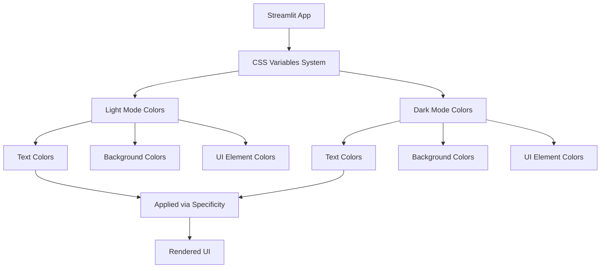
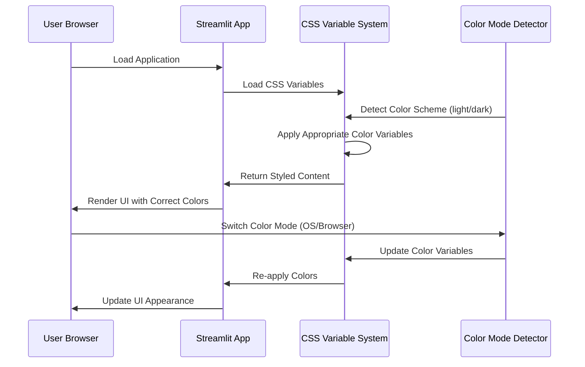

# Design Document: Font Color Refactoring

## Overview

本设计文档描述了对Streamlit Web应用中字体颜色相关代码的全面重构方案。当前系统存在严重的颜色代码冗余问题,浅色/深色模式样式混杂,过度使用`!important`规则,导致维护困难。重构目标是通过CSS变量(CSS Custom Properties)统一管理颜色,清晰分离浅色和深色模式,减少`!important`使用,提升代码可维护性和可读性。

重构涉及两个主要文件:
- **app_beautiful.py** - 包含大量内联CSS的主应用文件
- **styles.css** - 外部CSS样式文件

核心策略:
1. 使用CSS变量定义颜色方案
2. 利用CSS级联优先级替代`!important`
3. 明确分离浅色/深色模式样式
4. 统一颜色命名规范

## Architecture



重构架构的核心是建立一个CSS变量系统作为单一颜色真实来源(Single Source of Truth),所有颜色值从CSS变量中获取,通过媒体查询自动切换浅色/深色模式。

## Main Algorithm/Workflow



工作流程:
1. 应用加载时,CSS变量系统初始化
2. 检测用户的颜色模式偏好(浅色/深色)
3. 根据模式应用相应的CSS变量值
4. 所有UI元素从CSS变量获取颜色
5. 用户切换模式时,CSS变量自动更新

## Components and Interfaces

### Component 1: CSS Variable Definitions

**Purpose**: 定义应用的颜色方案作为CSS变量

**Interface**:
```css
:root {
  /* 浅色模式变量 */
  --text-primary: #000000;
  --text-secondary: #555555;
  --bg-primary: linear-gradient(...);
  /* ... 更多变量 */
}

@media (prefers-color-scheme: dark) {
  :root {
    /* 深色模式变量 */
    --text-primary: #FFFFFF;
    --text-secondary: #AAAAAA;
    --bg-primary: linear-gradient(...);
    /* ... 更多变量 */
  }
}
```

**Responsibilities**:
- 集中定义所有颜色值
- 为浅色和深色模式提供不同的颜色方案
- 提供语义化的变量名称

### Component 2: CSS Specificity Rules

**Purpose**: 使用CSS选择器优先级替代`!important`

**Interface**:
```css
/* 使用具体选择器增加优先级 */
.main .stMarkdown p {
  color: var(--text-primary);
  font-weight: 600;
}

/* 避免通配符 + !important */
/* 错误示例: * { color: #000000 !important; } */
```

**Responsibilities**:
- 通过选择器特异性控制样式优先级
- 避免过度使用`!important`
- 保持CSS规则清晰可维护

### Component 3: Mode-Specific Styles

**Purpose**: 清晰分离浅色和深色模式的样式规则

**Interface**:
```css
/* 浅色模式样式 */
.sidebar-item {
  color: var(--text-primary);
  background: var(--bg-sidebar);
}

/* 深色模式样式 */
@media (prefers-color-scheme: dark) {
  .sidebar-item {
    color: var(--text-primary);
    background: var(--bg-sidebar);
  }
}
```

**Responsibilities**:
- 为浅色模式定义默认样式
- 为深色模式定义覆盖样式
- 通过CSS变量实现自动切换

### Component 4: Streamlit Element Styling

**Purpose**: 针对Streamlit特定元素应用颜色

**Interface**:
```css
/* Streamlit data-testid 选择器 */
[data-testid="stSidebar"] {
  background: var(--bg-sidebar);
}

[data-testid="stSidebar"] .element-container {
  color: var(--text-primary);
}

[data-testid="stMetricLabel"] {
  color: var(--text-primary);
  font-weight: 800;
}
```

**Responsibilities**:
- 覆盖Streamlit默认样式
- 确保所有元素使用统一颜色方案
- 处理特殊元素(metrics, tabs, alerts等)

## Data Models

### Model 1: Color Variable Schema

```typescript
interface ColorVariables {
  // 文本颜色
  textPrimary: string;        // 主要文本颜色
  textSecondary: string;      // 次要文本颜色
  textPlaceholder: string;    // 占位符文本颜色
  
  // 背景颜色
  bgPrimary: string;          // 主背景
  bgSidebar: string;          // 侧边栏背景
  bgCard: string;             // 卡片背景
  bgInput: string;            // 输入框背景
  
  // UI元素颜色
  borderColor: string;        // 边框颜色
  accentColor: string;        // 强调色
  successColor: string;       // 成功提示色
  warningColor: string;       // 警告提示色
  errorColor: string;         // 错误提示色
}
```

**Validation Rules**:
- 所有颜色值必须是有效的CSS颜色格式(hex, rgb, rgba, linear-gradient等)
- 浅色模式的`textPrimary`必须是深色(接近黑色)
- 深色模式的`textPrimary`必须是浅色(接近白色)
- 对比度必须满足WCAG AA级标准(文本:背景 >= 4.5:1)

### Model 2: CSS Rule Priority

```typescript
interface CSSRule {
  selector: string;           // CSS选择器
  property: string;           // CSS属性
  value: string;              // CSS值
  specificity: number;        // 选择器特异性(计算值)
  useImportant: boolean;      // 是否使用!important(应尽量为false)
}
```

**Validation Rules**:
- `selector`不应包含通配符`*`作为唯一选择器
- `specificity`应通过增加选择器特异性提升,而非`!important`
- `useImportant`仅在覆盖第三方库样式时为true
- `value`应优先使用CSS变量,如`var(--text-primary)`

## Correctness Properties

*属性是关于系统行为的特征,应在所有有效执行中保持为真。属性是人类可读规范和机器可验证正确性保证之间的桥梁。*

### Property 1: 颜色变量一致性

对于任何给定的颜色模式(浅色或深色),所有使用相同语义的文本元素必须使用相同的CSS变量,确保颜色一致性。

**Validates: Requirements 1.1, 1.2**

### Property 2: 模式切换完整性

对于任何颜色模式切换(浅色↔深色),所有定义的CSS变量必须有对应的模式特定值,不存在未定义的变量。

**Validates: Requirements 2.1, 2.2**

### Property 3: Important规则最小化

对于任何CSS规则集,使用`!important`的规则数量应少于总规则数量的10%,优先通过选择器特异性控制优先级。

**Validates: Requirements 3.1, 3.2**

### Property 4: 文本可读性保证

对于任何颜色模式,主要文本颜色与主要背景颜色的对比度必须≥4.5:1(WCAG AA级),确保文本可读性。

**Validates: Requirements 1.3, 2.3**

### Property 5: 浅色模式文本颜色

对于浅色模式下的任何主要文本元素,其`color`属性必须解析为深色值(接近`#000000`),不能是浅色。

**Validates: Requirements 1.1**

### Property 6: 深色模式文本颜色

对于深色模式下的任何主要文本元素,其`color`属性必须解析为浅色值(接近`#FFFFFF`),不能是深色。

**Validates: Requirements 2.1**

### Property 7: CSS变量引用完整性

对于CSS文件中的任何`var(--variable-name)`引用,该变量必须在`:root`或对应媒体查询中有定义。

**Validates: Requirements 1.2, 2.2**

### Property 8: 冗余规则消除

对于任何两个CSS规则,如果它们的选择器等价且属性相同,则不应存在重复定义(除非一个是浅色模式默认,另一个是深色模式覆盖)。

**Validates: Requirements 3.1**

## Error Handling

### Error Scenario 1: CSS变量未定义

**Condition**: 当CSS规则引用未定义的变量时(如`var(--undefined-color)`)
**Response**: 浏览器将使用备用值或默认值,可能导致颜色显示不正确
**Recovery**: 
- 在开发环境中使用CSS linter检测未定义变量
- 为所有`var()`调用提供备用值,如`var(--text-primary, #000000)`
- 在CI/CD中集成CSS验证工具

### Error Scenario 2: 对比度不足

**Condition**: 当文本颜色与背景颜色对比度<4.5:1时
**Response**: 文本可读性差,影响用户体验,可能违反可访问性标准
**Recovery**:
- 使用对比度检查工具(如axe DevTools)验证颜色组合
- 调整颜色值直到满足WCAG AA级标准
- 在设计阶段建立颜色对比度测试

### Error Scenario 3: 模式切换时颜色闪烁

**Condition**: 当用户切换浅色/深色模式时,部分元素颜色未及时更新
**Response**: UI出现颜色不一致或闪烁现象
**Recovery**:
- 确保所有颜色都通过CSS变量定义
- 避免在JavaScript中硬编码颜色值
- 使用CSS `transition`属性平滑颜色切换

### Error Scenario 4: Streamlit更新导致样式冲突

**Condition**: Streamlit版本更新后,新的默认样式与自定义样式冲突
**Response**: UI显示异常,颜色方案被破坏
**Recovery**:
- 使用更具体的选择器增加优先级
- 监控Streamlit更新日志,及时调整样式
- 建立样式回归测试

## Testing Strategy

### Unit Testing Approach

**CSS变量定义测试**:
- 验证所有必需的CSS变量在`:root`中定义
- 验证浅色和深色模式的变量值不同
- 验证颜色值格式有效

**选择器特异性测试**:
- 计算关键选择器的特异性值
- 验证没有过度使用通配符选择器
- 确认`!important`使用数量<10%

**颜色对比度测试**:
- 使用自动化工具测试主要文本/背景组合
- 验证对比度≥4.5:1(WCAG AA级)
- 覆盖浅色和深色模式

**特定示例**:
- 测试侧边栏在浅色模式下文本为黑色
- 测试侧边栏在深色模式下文本为白色
- 测试输入框占位符颜色在两种模式下的区别

### Property-Based Testing Approach

本项目主要涉及CSS样式重构,不适合传统的property-based testing(针对纯函数)。但可以使用以下策略:

**快照测试(Snapshot Testing)**:
- 生成不同颜色模式下的UI快照
- 比对重构前后的视觉差异
- 确保重构不改变最终视觉效果

**CSS解析验证**:
- 解析CSS文件,提取所有颜色值
- 验证颜色值分布(是否集中在变量定义中)
- 检测硬编码颜色值的数量

### Integration Testing Approach

**浏览器渲染测试**:
- 在真实Streamlit应用中加载重构后的CSS
- 使用Playwright/Selenium在浅色/深色模式下截图
- 人工或自动比对视觉效果

**跨浏览器测试**:
- 在Chrome, Firefox, Safari中测试
- 验证CSS变量和媒体查询支持
- 确保颜色显示一致

**用户场景测试**:
- 模拟用户在应用中的常见操作
- 切换浅色/深色模式,观察颜色变化
- 验证所有交互元素(按钮,输入框,表格等)颜色正确

## Performance Considerations

**CSS变量性能**:
- CSS变量是浏览器原生特性,性能开销极小
- 避免在高频动画中动态修改CSS变量
- 现代浏览器对CSS变量有良好的缓存和优化

**选择器性能**:
- 避免过深的选择器嵌套(≤3层)
- 避免通用选择器`*`作为关键选择器
- 使用类选择器优于标签选择器

**重排/重绘优化**:
- 颜色更改仅触发重绘(repaint),不触发重排(reflow)
- 使用CSS `transition`时控制动画元素数量
- 批量应用颜色变化,避免多次触发渲染

## Security Considerations

**CSS注入防护**:
- 不从用户输入构建CSS规则
- 避免在`style`属性中直接插入变量
- 使用Streamlit的内置样式机制

**第三方CSS安全**:
- 审查所有外部CSS库的来源
- 使用Subresource Integrity(SRI)验证CDN资源
- 定期更新依赖的CSS库

## Dependencies

**外部依赖**:
- **Streamlit**: Python Web框架(现有依赖)
- 无新增外部依赖

**开发工具**:
- **CSS Linter** (stylelint): 验证CSS语法和变量定义
- **Contrast Checker** (axe DevTools): 验证颜色对比度
- **Browser DevTools**: 调试CSS变量和媒体查询

**浏览器兼容性**:
- CSS变量: Chrome 49+, Firefox 31+, Safari 9.1+
- `prefers-color-scheme`: Chrome 76+, Firefox 67+, Safari 12.1+
- 目标浏览器: 所有现代浏览器(2020年后版本)
