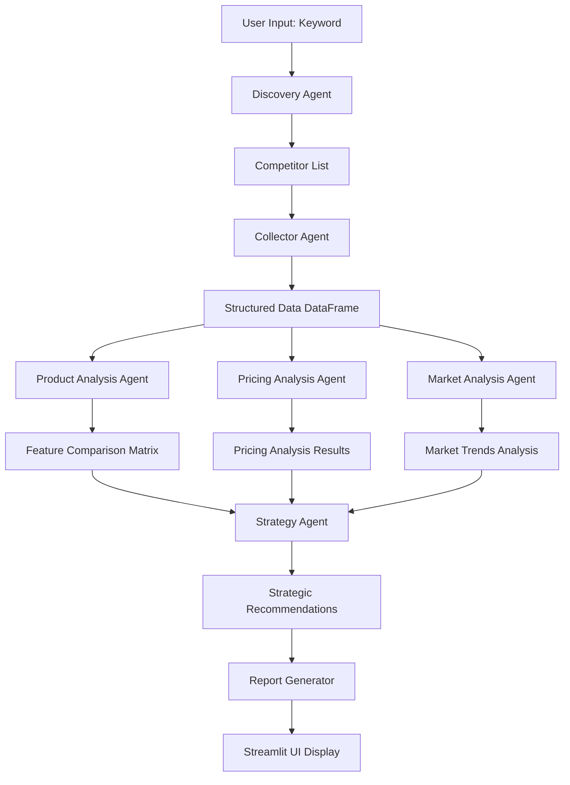
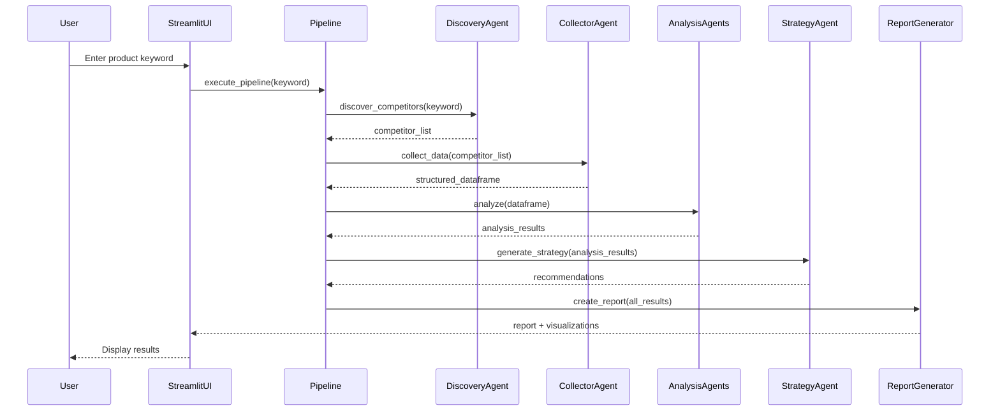

# Design Document: Multi-Agent Competitor Analysis System

## Overview

The Multi-Agent Competitor Analysis System is a Python-based application that uses multiple specialized agents to discover, collect, analyze, and generate strategic insights about product competitors. The system follows a pipeline architecture where each agent performs a specific analysis task, culminating in a comprehensive competitor analysis report presented through a Streamlit web interface.

## Architecture



## Main Algorithm/Workflow




## Components and Interfaces

### Component 1: Discovery Agent

**Purpose**: Discovers 3-5 competitor products based on a keyword input

**Interface**:
```python
class DiscoveryAgent:
    def discover_competitors(self, keyword: str, api_key: str) -> List[Dict[str, str]]:
        """
        Discovers competitor products based on keyword
        
        Args:
            keyword: Product category keyword (e.g., "手机")
            api_key: API authentication key
            
        Returns:
            List of competitor dictionaries with basic info:
            [{"name": str, "company": str}, ...]
        """
        pass
```

**Responsibilities**:
- Accept product keyword input
- Return 3-5 competitor product names and companies
- Use mock data for demonstration purposes
- Validate API key

### Component 2: Collector Agent

**Purpose**: Collects detailed information about discovered competitors

**Interface**:
```python
class CollectorAgent:
    def collect_data(self, competitors: List[Dict[str, str]], api_key: str) -> pd.DataFrame:
        """
        Collects detailed data for each competitor
        
        Args:
            competitors: List of competitor basic info
            api_key: API authentication key
            
        Returns:
            DataFrame with columns:
            - product_name: str
            - company: str
            - features: List[str]
            - price: float
            - rating: float
        """
        pass
```

**Responsibilities**:
- Enrich competitor data with detailed information
- Structure data into pandas DataFrame format
- Use mock data for features, pricing, ratings
- Validate data completeness


### Component 3: Product Analysis Agent

**Purpose**: Analyzes product features and creates comparison matrix

**Interface**:
```python
class ProductAnalysisAgent:
    def analyze_features(self, data: pd.DataFrame, api_key: str) -> pd.DataFrame:
        """
        Creates feature comparison matrix
        
        Args:
            data: Structured competitor data
            api_key: API authentication key
            
        Returns:
            Feature comparison matrix (products × features)
        """
        pass
```

**Responsibilities**:
- Extract all unique features across competitors
- Create binary feature matrix (has/doesn't have)
- Identify feature gaps and differentiators

### Component 4: Pricing Analysis Agent

**Purpose**: Analyzes pricing strategies and value propositions

**Interface**:
```python
class PricingAnalysisAgent:
    def analyze_pricing(self, data: pd.DataFrame, api_key: str) -> Dict[str, Any]:
        """
        Analyzes pricing across competitors
        
        Args:
            data: Structured competitor data
            api_key: API authentication key
            
        Returns:
            Dictionary with:
            - most_expensive: Dict[str, float]
            - least_expensive: Dict[str, float]
            - best_value: Dict[str, Any]  # Best rating/price ratio
            - price_range: Tuple[float, float]
            - average_price: float
        """
        pass
```

**Responsibilities**:
- Identify pricing extremes (highest/lowest)
- Calculate value propositions (rating/price ratio)
- Compute pricing statistics

### Component 5: Market Analysis Agent

**Purpose**: Analyzes market trends and positioning

**Interface**:
```python
class MarketAnalysisAgent:
    def analyze_market(self, data: pd.DataFrame, api_key: str) -> Dict[str, Any]:
        """
        Analyzes market trends
        
        Args:
            data: Structured competitor data
            api_key: API authentication key
            
        Returns:
            Dictionary with:
            - market_leader: str
            - average_rating: float
            - trends: List[str]  # Mock trend observations
        """
        pass
```

**Responsibilities**:
- Identify market leader (highest rating)
- Calculate market averages
- Generate mock trend insights


### Component 6: Strategy Agent

**Purpose**: Generates strategic recommendations based on all analysis results

**Interface**:
```python
class StrategyAgent:
    def generate_strategy(
        self,
        product_analysis: pd.DataFrame,
        pricing_analysis: Dict[str, Any],
        market_analysis: Dict[str, Any],
        api_key: str
    ) -> str:
        """
        Generates strategic recommendations
        
        Args:
            product_analysis: Feature comparison matrix
            pricing_analysis: Pricing analysis results
            market_analysis: Market trends analysis
            api_key: API authentication key
            
        Returns:
            Markdown-formatted strategic recommendations
        """
        pass
```

**Responsibilities**:
- Synthesize insights from all analysis agents
- Generate actionable recommendations
- Format output as readable markdown text

### Component 7: Pipeline Orchestrator

**Purpose**: Coordinates the execution flow of all agents

**Interface**:
```python
class AnalysisPipeline:
    def __init__(self, api_key: str):
        """Initialize pipeline with API key"""
        pass
    
    def execute(self, keyword: str) -> Dict[str, Any]:
        """
        Executes full analysis pipeline
        
        Args:
            keyword: Product category keyword
            
        Returns:
            Dictionary containing all analysis results:
            - competitors: List[Dict]
            - data: pd.DataFrame
            - product_analysis: pd.DataFrame
            - pricing_analysis: Dict
            - market_analysis: Dict
            - strategy: str
        """
        pass
```

**Responsibilities**:
- Initialize all agents
- Execute agents in correct sequence
- Pass data between agents
- Aggregate all results


### Component 8: Report Generator

**Purpose**: Generates comprehensive markdown reports from analysis results

**Interface**:
```python
class ReportGenerator:
    def generate_report(self, results: Dict[str, Any]) -> str:
        """
        Creates formatted markdown report
        
        Args:
            results: All analysis results from pipeline
            
        Returns:
            Markdown-formatted report string
        """
        pass
```

**Responsibilities**:
- Format all analysis results into readable markdown
- Include tables, lists, and structured sections
- Create executive summary

### Component 9: Visualization Generator

**Purpose**: Creates charts for data visualization

**Interface**:
```python
class VisualizationGenerator:
    def create_price_rating_chart(self, data: pd.DataFrame) -> matplotlib.figure.Figure:
        """
        Creates scatter plot of price vs rating
        
        Args:
            data: Competitor data with price and rating
            
        Returns:
            Matplotlib figure object
        """
        pass
    
    def create_feature_heatmap(self, feature_matrix: pd.DataFrame) -> matplotlib.figure.Figure:
        """
        Creates heatmap of feature comparison
        
        Args:
            feature_matrix: Binary feature comparison matrix
            
        Returns:
            Matplotlib figure object
        """
        pass
```

**Responsibilities**:
- Generate price vs rating scatter plots
- Create feature comparison heatmaps
- Use matplotlib for visualization

### Component 10: Streamlit UI

**Purpose**: Provides web interface for user interaction

**Interface**:
```python
def main():
    """
    Main Streamlit application entry point
    
    Renders:
    - Title and description
    - Text input for product keyword
    - Submit button
    - Results display area with tabs for:
      - Overview table
      - Analysis results
      - Visualizations
      - Strategic recommendations
    """
    pass
```

**Responsibilities**:
- Render input form
- Execute pipeline on submit
- Display results in organized tabs
- Show visualizations and reports


## Data Models

### Model 1: CompetitorBasicInfo

```python
class CompetitorBasicInfo(TypedDict):
    name: str        # Product name
    company: str     # Company name
```

**Validation Rules**:
- Both fields must be non-empty strings
- Name should be unique within a competitor list

### Model 2: CompetitorDetailedData

```python
class CompetitorDetailedData(TypedDict):
    product_name: str         # Product name
    company: str              # Company name
    features: List[str]       # List of product features
    price: float              # Price in currency units
    rating: float             # User rating (0-5 scale)
```

**Validation Rules**:
- product_name and company must be non-empty strings
- features must be a non-empty list
- price must be positive (> 0)
- rating must be between 0.0 and 5.0 inclusive

### Model 3: PricingAnalysisResult

```python
class PricingAnalysisResult(TypedDict):
    most_expensive: Dict[str, float]      # {"product": price}
    least_expensive: Dict[str, float]     # {"product": price}
    best_value: Dict[str, Any]            # {"product": name, "value_ratio": float}
    price_range: Tuple[float, float]      # (min, max)
    average_price: float                  # Mean price
```

**Validation Rules**:
- All prices must be positive
- price_range[0] <= price_range[1]
- best_value must include both product name and value_ratio

### Model 4: MarketAnalysisResult

```python
class MarketAnalysisResult(TypedDict):
    market_leader: str          # Product with highest rating
    average_rating: float       # Mean rating across all products
    trends: List[str]           # List of market trend observations
```

**Validation Rules**:
- market_leader must be non-empty string
- average_rating must be between 0.0 and 5.0
- trends should contain at least one observation

### Model 5: PipelineResult

```python
class PipelineResult(TypedDict):
    competitors: List[CompetitorBasicInfo]
    data: pd.DataFrame
    product_analysis: pd.DataFrame
    pricing_analysis: PricingAnalysisResult
    market_analysis: MarketAnalysisResult
    strategy: str
```

**Validation Rules**:
- competitors list must have 3-5 items
- All DataFrames must be non-empty
- strategy must be non-empty string


## Key Functions with Formal Specifications

### Function 1: discover_competitors()

```python
def discover_competitors(keyword: str, api_key: str) -> List[CompetitorBasicInfo]:
    """Discovers competitor products based on keyword"""
    pass
```

**Preconditions:**
- `keyword` is non-empty string
- `api_key` equals "xwjljbg"

**Postconditions:**
- Returns list of 3-5 CompetitorBasicInfo dictionaries
- All returned competitors have non-empty name and company fields
- No duplicate product names in returned list

**Loop Invariants:** N/A (no loops in specification)

### Function 2: collect_data()

```python
def collect_data(competitors: List[CompetitorBasicInfo], api_key: str) -> pd.DataFrame:
    """Collects detailed data for competitors"""
    pass
```

**Preconditions:**
- `competitors` is non-empty list of valid CompetitorBasicInfo
- `api_key` equals "xwjljbg"

**Postconditions:**
- Returns DataFrame with exactly len(competitors) rows
- DataFrame contains columns: product_name, company, features, price, rating
- All prices are positive floats
- All ratings are between 0.0 and 5.0
- All features lists are non-empty

**Loop Invariants:**
- For each iteration over competitors: all processed rows have valid data

### Function 3: analyze_features()

```python
def analyze_features(data: pd.DataFrame, api_key: str) -> pd.DataFrame:
    """Creates feature comparison matrix"""
    pass
```

**Preconditions:**
- `data` is non-empty DataFrame with 'product_name' and 'features' columns
- `api_key` equals "xwjljbg"

**Postconditions:**
- Returns DataFrame where rows are products and columns are features
- Matrix contains only boolean or binary values (True/False or 1/0)
- Number of rows equals number of products in input
- Number of columns equals number of unique features across all products

**Loop Invariants:**
- For each feature column: values are boolean/binary
- For each product row: at least one feature is True

### Function 4: analyze_pricing()

```python
def analyze_pricing(data: pd.DataFrame, api_key: str) -> PricingAnalysisResult:
    """Analyzes pricing strategies"""
    pass
```

**Preconditions:**
- `data` is non-empty DataFrame with 'product_name', 'price', and 'rating' columns
- All prices in data are positive
- All ratings in data are between 0.0 and 5.0
- `api_key` equals "xwjljbg"

**Postconditions:**
- `most_expensive` contains the product with maximum price
- `least_expensive` contains the product with minimum price
- `best_value` product has highest rating/price ratio
- `price_range` tuple has min <= max
- `average_price` equals mean of all prices

**Loop Invariants:** N/A (uses vectorized operations)


### Function 5: execute_pipeline()

```python
def execute_pipeline(keyword: str, api_key: str) -> PipelineResult:
    """Executes the complete analysis pipeline"""
    pass
```

**Preconditions:**
- `keyword` is non-empty string
- `api_key` equals "xwjljbg"

**Postconditions:**
- Returns PipelineResult with all required fields populated
- Result contains 3-5 competitors
- All DataFrames are non-empty
- Strategy string is non-empty
- All intermediate results are internally consistent

**Loop Invariants:** N/A (sequential execution)

## Algorithmic Pseudocode

### Main Processing Algorithm

```pascal
ALGORITHM execute_pipeline(keyword, api_key)
INPUT: keyword of type String, api_key of type String
OUTPUT: result of type PipelineResult

BEGIN
  ASSERT keyword ≠ "" AND api_key = "xwjljbg"
  
  // Step 1: Discover competitors
  competitors ← discover_competitors(keyword, api_key)
  ASSERT 3 ≤ length(competitors) ≤ 5
  
  // Step 2: Collect detailed data
  data ← collect_data(competitors, api_key)
  ASSERT rows(data) = length(competitors)
  
  // Step 3: Parallel analysis phase
  product_analysis ← analyze_features(data, api_key)
  pricing_analysis ← analyze_pricing(data, api_key)
  market_analysis ← analyze_market(data, api_key)
  
  // Step 4: Generate strategy
  strategy ← generate_strategy(
    product_analysis,
    pricing_analysis,
    market_analysis,
    api_key
  )
  ASSERT strategy ≠ ""
  
  // Step 5: Aggregate results
  result ← create_pipeline_result(
    competitors,
    data,
    product_analysis,
    pricing_analysis,
    market_analysis,
    strategy
  )
  
  ASSERT result is valid PipelineResult
  
  RETURN result
END
```

**Preconditions:**
- keyword is non-empty string
- api_key is valid authentication key ("xwjljbg")

**Postconditions:**
- result contains all required analysis components
- All data structures are properly populated
- Analysis results are internally consistent

**Loop Invariants:**
- Each step produces valid output for next step
- Data integrity maintained throughout pipeline


### Discovery Algorithm

```pascal
ALGORITHM discover_competitors(keyword, api_key)
INPUT: keyword of type String, api_key of type String
OUTPUT: competitors of type List[CompetitorBasicInfo]

BEGIN
  // Validate inputs
  IF keyword = "" OR api_key ≠ "xwjljbg" THEN
    RAISE ValueError("Invalid input parameters")
  END IF
  
  // Mock data lookup based on keyword
  mock_database ← get_mock_competitor_database()
  
  IF keyword exists in mock_database THEN
    competitors ← mock_database[keyword]
  ELSE
    competitors ← get_default_competitors()
  END IF
  
  // Ensure 3-5 competitors
  IF length(competitors) < 3 THEN
    competitors ← pad_to_minimum(competitors, 3)
  END IF
  
  IF length(competitors) > 5 THEN
    competitors ← competitors[0:5]
  END IF
  
  ASSERT 3 ≤ length(competitors) ≤ 5
  
  RETURN competitors
END
```

**Preconditions:**
- keyword parameter is provided (may be empty, validation handles this)
- api_key parameter is provided

**Postconditions:**
- Returns list of 3-5 competitors
- All competitors have valid name and company fields
- No duplicate names in list

**Loop Invariants:** N/A (uses list slicing, not explicit loops)

### Data Collection Algorithm

```pascal
ALGORITHM collect_data(competitors, api_key)
INPUT: competitors of type List[CompetitorBasicInfo], api_key of type String
OUTPUT: data of type DataFrame

BEGIN
  ASSERT length(competitors) > 0 AND api_key = "xwjljbg"
  
  rows ← empty list
  
  FOR each competitor IN competitors DO
    ASSERT all_processed_rows_valid(rows)
    
    // Generate mock detailed data
    row ← create_empty_row()
    row.product_name ← competitor.name
    row.company ← competitor.company
    row.features ← generate_mock_features(competitor.name)
    row.price ← generate_mock_price(competitor.name)
    row.rating ← generate_mock_rating(competitor.name)
    
    ASSERT row.price > 0 AND 0 ≤ row.rating ≤ 5
    
    rows.append(row)
  END FOR
  
  data ← create_dataframe(rows)
  
  ASSERT rows(data) = length(competitors)
  
  RETURN data
END
```

**Preconditions:**
- competitors is non-empty list
- api_key is valid

**Postconditions:**
- Returns DataFrame with one row per competitor
- All required columns present and valid
- All prices positive, all ratings in range

**Loop Invariants:**
- All previously processed rows have valid data
- Number of processed rows equals current iteration count


### Feature Analysis Algorithm

```pascal
ALGORITHM analyze_features(data, api_key)
INPUT: data of type DataFrame, api_key of type String
OUTPUT: feature_matrix of type DataFrame

BEGIN
  ASSERT rows(data) > 0 AND api_key = "xwjljbg"
  
  // Extract all unique features
  all_features ← empty set
  
  FOR each row IN data DO
    FOR each feature IN row.features DO
      all_features.add(feature)
    END FOR
  END FOR
  
  all_features ← sort(all_features)
  
  // Create binary matrix
  matrix ← create_empty_matrix(rows(data), length(all_features))
  
  FOR each product_index, row IN enumerate(data) DO
    ASSERT current_row_has_valid_format(matrix[product_index])
    
    FOR each feature_index, feature IN enumerate(all_features) DO
      IF feature IN row.features THEN
        matrix[product_index][feature_index] ← 1
      ELSE
        matrix[product_index][feature_index] ← 0
      END IF
    END FOR
  END FOR
  
  feature_matrix ← create_dataframe(
    matrix,
    index=data.product_name,
    columns=all_features
  )
  
  ASSERT rows(feature_matrix) = rows(data)
  ASSERT columns(feature_matrix) = length(all_features)
  
  RETURN feature_matrix
END
```

**Preconditions:**
- data is non-empty DataFrame
- data contains 'product_name' and 'features' columns
- api_key is valid

**Postconditions:**
- Returns binary feature matrix
- Rows correspond to products
- Columns correspond to unique features
- All values are 0 or 1

**Loop Invariants:**
- All processed matrix entries are binary (0 or 1)
- Matrix dimensions remain consistent throughout construction

## Example Usage

```python
# Example 1: Basic usage - complete pipeline
from core.pipeline import AnalysisPipeline
from config import API_KEY

pipeline = AnalysisPipeline(API_KEY)
results = pipeline.execute("手机")

print(f"Found {len(results['competitors'])} competitors")
print(f"Price range: {results['pricing_analysis']['price_range']}")
print(f"Market leader: {results['market_analysis']['market_leader']}")

# Example 2: Individual agent usage
from agents.discovery import DiscoveryAgent
from agents.collector import CollectorAgent
from config import API_KEY

discovery = DiscoveryAgent()
competitors = discovery.discover_competitors("手机", API_KEY)

collector = CollectorAgent()
data = collector.collect_data(competitors, API_KEY)

print(data.head())

# Example 3: Streamlit application
import streamlit as st
from core.pipeline import AnalysisPipeline
from config import API_KEY

def main():
    st.title("竞品分析系统")
    
    keyword = st.text_input("请输入产品关键词", "手机")
    
    if st.button("开始分析"):
        pipeline = AnalysisPipeline(API_KEY)
        results = pipeline.execute(keyword)
        
        st.dataframe(results['data'])
        st.markdown(results['strategy'])

if __name__ == "__main__":
    main()
```


## Correctness Properties

*A property is a characteristic or behavior that should hold true across all valid executions of a system—essentially, a formal statement about what the system should do. Properties serve as the bridge between human-readable specifications and machine-verifiable correctness guarantees.*

### Property 1: Competitor Count Range

*For any* valid product keyword, the discovery agent shall return between 3 and 5 competitors inclusive.

**Validates: Requirements 1.1**

### Property 2: Competitor Data Completeness

*For any* competitor returned by the discovery agent, both name and company fields shall be non-empty strings.

**Validates: Requirements 1.2**

### Property 3: Discovery Determinism

*For any* product keyword, calling the discovery agent multiple times with the same keyword shall return identical competitor lists.

**Validates: Requirements 1.5**

### Property 4: Collector Row Count Consistency

*For any* list of competitors, the collector agent shall return a DataFrame with exactly as many rows as there are competitors in the input list.

**Validates: Requirements 2.1**

### Property 5: Data Validation - Positive Prices

*For any* competitor data collected, all price values shall be positive (greater than zero).

**Validates: Requirements 2.3**

### Property 6: Data Validation - Rating Range

*For any* competitor data collected, all rating values shall be between 0.0 and 5.0 inclusive.

**Validates: Requirements 2.4**

### Property 7: Data Validation - Non-Empty Features

*For any* competitor data collected, each product shall have a non-empty list of features.

**Validates: Requirements 2.5**

### Property 8: API Key Authentication

*For any* agent method call, if the provided API key does not equal "xwjljbg", the method shall raise a ValueError before performing any operations.

**Validates: Requirements 3.1, 3.2**

### Property 9: Feature Matrix Dimensions

*For any* competitor data analyzed, the feature comparison matrix shall have one row per product and one column per unique feature across all products.

**Validates: Requirements 4.2, 4.5, 4.6**

### Property 10: Feature Matrix Binary Values

*For any* feature comparison matrix, all cell values shall be binary (0 or 1, or True or False), representing whether a product has a specific feature.

**Validates: Requirements 4.3**

### Property 11: Pricing Maximum Identification

*For any* competitor data with prices, the product identified as "most expensive" shall have a price greater than or equal to all other products.

**Validates: Requirements 5.1, 5.6**

### Property 12: Pricing Minimum Identification

*For any* competitor data with prices, the product identified as "least expensive" shall have a price less than or equal to all other products.

**Validates: Requirements 5.2, 5.7**

### Property 13: Best Value Calculation

*For any* competitor data with non-zero prices, the product with the best value shall have a rating-to-price ratio greater than or equal to all other products.

**Validates: Requirements 5.3, 5.8**

### Property 14: Price Range Correctness

*For any* competitor data, the calculated price range tuple shall have its first element (minimum) less than or equal to its second element (maximum), and these shall match the actual minimum and maximum prices in the data.

**Validates: Requirements 5.4**

### Property 15: Average Price Calculation

*For any* competitor data, the calculated average price shall equal the arithmetic mean of all product prices.

**Validates: Requirements 5.5**

### Property 16: Market Leader Identification

*For any* competitor data, the product identified as market leader shall have a rating greater than or equal to all other products.

**Validates: Requirements 6.1, 6.4**

### Property 17: Average Rating Calculation

*For any* competitor data, the calculated average rating shall equal the arithmetic mean of all product ratings and shall be between 0.0 and 5.0 inclusive.

**Validates: Requirements 6.2, 6.5**

### Property 18: Strategy Output Non-Empty

*For any* valid analysis results, the strategy agent shall generate a non-empty string as strategic recommendations.

**Validates: Requirements 7.1, 7.3**

### Property 19: Pipeline Result Completeness

*For any* successful pipeline execution, the returned result shall contain all required fields (competitors, data, product_analysis, pricing_analysis, market_analysis, strategy) and none shall be None or empty.

**Validates: Requirements 8.3, 8.4**

### Property 20: Report Generation Non-Empty

*For any* analysis results provided, the report generator shall produce a non-empty markdown-formatted string.

**Validates: Requirements 9.4**

### Property 21: Visualization Creation

*For any* valid competitor data, the system shall successfully create matplotlib figure objects for both price-rating scatter plot and feature heatmap.

**Validates: Requirements 10.1, 10.2**


## Error Handling

### Error Scenario 1: Invalid API Key

**Condition**: When any agent method receives an API key that does not equal "xwjljbg"
**Response**: Raise `ValueError` with message "Invalid API key"
**Recovery**: User must provide correct API key configured in config.py

### Error Scenario 2: Empty Keyword Input

**Condition**: When discovery agent receives an empty or whitespace-only keyword
**Response**: Raise `ValueError` with message "Keyword cannot be empty"
**Recovery**: User must provide non-empty product keyword

### Error Scenario 3: Invalid Data Format

**Condition**: When a downstream agent receives data that doesn't meet preconditions (e.g., missing required columns)
**Response**: Raise `ValueError` with descriptive message about missing/invalid data
**Recovery**: Check upstream agent implementation for data format issues

### Error Scenario 4: Pricing Calculation with Zero Prices

**Condition**: When pricing analysis encounters products with zero or negative prices
**Response**: Filter out invalid prices and log warning; continue with valid data only
**Recovery**: System continues with valid subset of data

### Error Scenario 5: Empty Competitor List

**Condition**: When discovery agent finds no competitors for a keyword
**Response**: Return default set of 3 generic competitors as fallback
**Recovery**: System continues with fallback data; user notified via UI

## Testing Strategy

### Unit Testing Approach

**Focus Areas**:
- Individual agent methods with specific input examples
- Data validation functions
- Mock data generation utilities
- Error handling for invalid inputs

**Key Test Cases**:
- Discovery agent returns 3-5 competitors for known keywords
- Collector agent creates DataFrame with correct schema
- Pricing analysis correctly identifies max/min prices
- Feature analysis creates binary matrix with correct dimensions
- API key validation rejects invalid keys

**Coverage Goals**:
- 80% code coverage minimum
- All error paths tested
- All public methods tested

### Property-Based Testing Approach

**Property Test Library**: hypothesis (Python)

**Key Properties to Test**:
- Competitor count invariant (3-5 competitors)
- Data validation ranges (prices > 0, ratings 0-5)
- Feature matrix dimensions match input data
- Pricing analysis consistency (max >= all, min <= all)
- Market leader has highest rating
- Pipeline result completeness

**Generator Strategies**:
- Random keyword strings
- Random competitor lists (varying sizes)
- Random price/rating values within valid ranges
- Random feature lists

### Integration Testing Approach

**Integration Points**:
- Pipeline orchestration: test complete flow from keyword to results
- Agent interaction: verify data passing between agents
- UI integration: test Streamlit app with pipeline

**Test Scenarios**:
- End-to-end pipeline execution with various keywords
- Verify all agents receive correct input format
- Confirm final results include all required components
- Test UI displays results correctly


## Performance Considerations

**Response Time Goals**:
- Full pipeline execution: < 2 seconds (using mock data)
- Individual agent operations: < 500ms
- Streamlit UI rendering: < 1 second after computation

**Optimization Strategies**:
- Use pandas vectorized operations for analysis
- Minimize DataFrame copies
- Cache mock data in memory
- Lazy load matplotlib only when visualization needed

**Scalability Considerations**:
- System designed for 3-5 competitors (small scale)
- Mock data approach eliminates external API latency
- In-memory processing suitable for demo purposes
- For production: would need caching, async operations, database storage

## Security Considerations

**API Key Management**:
- API key stored in config.py (not hardcoded)
- For production: use environment variables or secrets manager
- Current implementation: single shared key for demo purposes

**Input Validation**:
- Validate all user inputs (keyword, API key)
- Sanitize inputs to prevent injection attacks
- Validate data types and ranges for all parameters

**Data Privacy**:
- Mock data only, no real competitor data
- No external API calls, no data leakage risk
- For production: implement proper data handling and privacy controls

**Authentication**:
- Simple API key validation for demo
- For production: implement proper authentication/authorization
- Consider rate limiting for API endpoints

## Dependencies

**Core Dependencies**:
- `streamlit >= 1.28.0` - Web UI framework
- `pandas >= 2.0.0` - Data manipulation and analysis
- `matplotlib >= 3.7.0` - Data visualization
- `typing-extensions >= 4.7.0` - Type hints support

**Development Dependencies**:
- `pytest >= 7.4.0` - Testing framework
- `hypothesis >= 6.82.0` - Property-based testing
- `pytest-cov >= 4.1.0` - Coverage reporting
- `black >= 23.7.0` - Code formatting
- `mypy >= 1.4.0` - Static type checking

**Python Version**:
- Python >= 3.8 (for TypedDict support)
- Recommended: Python 3.10 or 3.11

**System Dependencies**:
- No external system dependencies
- Pure Python implementation
- Cross-platform compatible (Windows, Linux, macOS)
