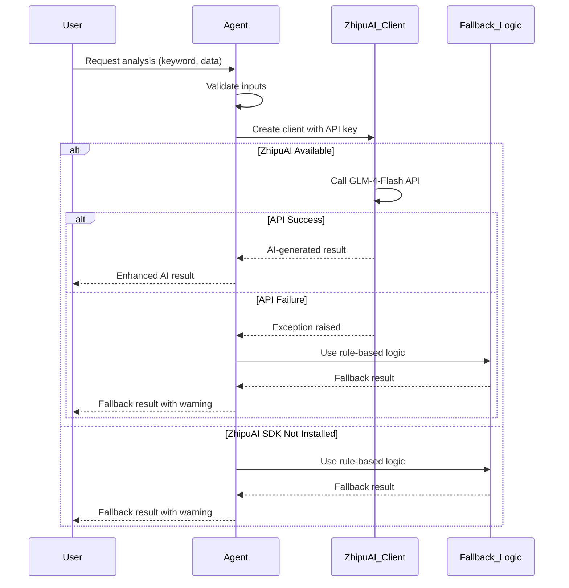

# Design Document: ZhipuAI Full Integration

## Overview

This design outlines the comprehensive integration of ZhipuAI (智谱AI) GLM-4-Flash model into all agents of the multi-agent competitor analysis system. Currently, only the strategy agent has partial ZhipuAI integration. This design will extend AI capabilities to all six agents (discovery, collector, product_analysis, pricing_analysis, market_analysis, strategy) while maintaining backward compatibility through fallback mechanisms.

## Main Algorithm/Workflow



## Core Interfaces/Types

```python
from typing import List, Dict, Any, Optional
from zhipuai import ZhipuAI
import pandas as pd

class AIEnhancedAgentBase:
    """Base class for all AI-enhanced agents with fallback support."""
    
    def __init__(self, api_key: Optional[str] = None):
        """
        Initialize agent with optional ZhipuAI support.
        
        Args:
            api_key: ZhipuAI API key. If None, uses fallback mode.
        """
        self.api_key = api_key
        self.use_ai = False
        self.client = None
        
        if api_key:
            try:
                self.client = ZhipuAI(api_key=api_key)
                self.use_ai = True
            except Exception as e:
                print(f"⚠️  ZhipuAI initialization failed: {e}")
                self.use_ai = False

class DiscoveryAgentAI:
    """AI-enhanced competitor discovery agent."""
    
    def discover_competitors(
        self, 
        keyword: str, 
        api_key: str
    ) -> List[Dict[str, str]]:
        """
        Discover competitors using AI-powered analysis.
        
        Returns: List of competitor dicts with 'name' and 'company' keys.
        """
        pass

class CollectorAgentAI:
    """AI-enhanced data collection agent."""
    
    def collect_data(
        self,
        competitors: List[Dict[str, str]],
        api_key: str
    ) -> pd.DataFrame:
        """
        Collect detailed competitor data using AI enrichment.
        
        Returns: DataFrame with columns: product_name, company, features, price, rating.
        """
        pass

class ProductAnalysisAgentAI:
    """AI-enhanced product analysis agent."""
    
    def analyze_features(
        self,
        data: pd.DataFrame,
        api_key: str
    ) -> pd.DataFrame:
        """
        Analyze product features using AI-powered categorization.
        
        Returns: Binary feature comparison matrix.
        """
        pass

class PricingAnalysisAgentAI:
    """AI-enhanced pricing analysis agent."""
    
    def analyze_pricing(
        self,
        data: pd.DataFrame,
        api_key: str
    ) -> Dict[str, Any]:
        """
        Analyze pricing strategies using AI insights.
        
        Returns: Dict with pricing analysis results.
        """
        pass

class MarketAnalysisAgentAI:
    """AI-enhanced market analysis agent."""
    
    def analyze_market(
        self,
        data: pd.DataFrame,
        api_key: str
    ) -> Dict[str, Any]:
        """
        Analyze market trends using AI-powered insights.
        
        Returns: Dict with market analysis results.
        """
        pass
```

## Key Functions with Formal Specifications

### Function 1: _create_zhipuai_client()

```python
def _create_zhipuai_client(api_key: str) -> Optional[ZhipuAI]:
    """Create ZhipuAI client with error handling."""
    try:
        client = ZhipuAI(api_key=api_key)
        return client
    except Exception as e:
        print(f"⚠️  ZhipuAI client creation failed: {e}")
        return None
```

**Preconditions:**
- `api_key` is a non-empty string
- ZhipuAI SDK is installed

**Postconditions:**
- If successful: Returns valid ZhipuAI client instance
- If error: Returns None and logs warning
- No exceptions propagate to caller

**Loop Invariants:** N/A (no loops)

### Function 2: _call_glm_api()

```python
def _call_glm_api(
    client: ZhipuAI,
    system_prompt: str,
    user_prompt: str,
    temperature: float = 0.7
) -> Optional[str]:
    """Call GLM-4-Flash API with standardized parameters."""
    pass
```

**Preconditions:**
- `client` is a valid ZhipuAI instance
- `system_prompt` and `user_prompt` are non-empty strings
- `temperature` is between 0.0 and 1.0

**Postconditions:**
- If API call succeeds: Returns AI-generated content string (non-empty)
- If API call fails: Returns None
- No exceptions propagate to caller

**Loop Invariants:** N/A (no loops)

### Function 3: discover_competitors_with_ai()

```python
def discover_competitors_with_ai(
    keyword: str,
    client: ZhipuAI
) -> List[Dict[str, str]]:
    """Use AI to discover competitors for a product category."""
    pass
```

**Preconditions:**
- `keyword` is non-empty string (after stripping whitespace)
- `client` is a valid ZhipuAI instance

**Postconditions:**
- Returns list of 3-5 competitor dictionaries
- Each dict has 'name' and 'company' keys with non-empty string values
- If AI call fails, fallback to mock data

**Loop Invariants:** N/A

### Function 4: enrich_competitor_data_with_ai()

```python
def enrich_competitor_data_with_ai(
    competitors: List[Dict[str, str]],
    client: ZhipuAI
) -> pd.DataFrame:
    """Use AI to generate detailed competitor data."""
    pass
```

**Preconditions:**
- `competitors` is non-empty list of dicts with 'name' and 'company' keys
- `client` is a valid ZhipuAI instance

**Postconditions:**
- Returns DataFrame with columns: product_name, company, features, price, rating
- `features` is non-empty list of strings
- `price` is positive float
- `rating` is float between 0.0 and 5.0
- Number of rows equals length of input `competitors` list

**Loop Invariants:**
- For each processed competitor: all previously processed rows are valid
- DataFrame structure remains consistent throughout iteration

### Function 5: analyze_features_with_ai()

```python
def analyze_features_with_ai(
    data: pd.DataFrame,
    client: ZhipuAI
) -> pd.DataFrame:
    """Use AI to categorize and normalize product features."""
    pass
```

**Preconditions:**
- `data` contains 'product_name' and 'features' columns
- `data` is non-empty
- `client` is a valid ZhipuAI instance

**Postconditions:**
- Returns binary feature comparison matrix
- Rows indexed by product names
- Columns are normalized feature names
- Values are 1 (has feature) or 0 (doesn't have feature)
- All feature names are standardized/normalized

**Loop Invariants:** N/A

## Algorithmic Pseudocode

### Main Processing Algorithm

```python
ALGORITHM integrate_zhipuai_into_agent(agent_type, api_key, input_data)
INPUT: agent_type (str), api_key (str), input_data (Any)
OUTPUT: result (Any)

BEGIN
  ASSERT api_key is not None
  ASSERT input_data is valid for agent_type
  
  // Step 1: Initialize ZhipuAI client
  client ← create_zhipuai_client(api_key)
  
  IF client is None THEN
    PRINT "⚠️  Using fallback mode (ZhipuAI unavailable)"
    result ← execute_fallback_logic(agent_type, input_data)
    RETURN result
  END IF
  
  // Step 2: Execute AI-enhanced logic with error handling
  TRY
    MATCH agent_type WITH
      CASE "discovery":
        result ← discover_competitors_with_ai(input_data.keyword, client)
      CASE "collector":
        result ← enrich_competitor_data_with_ai(input_data.competitors, client)
      CASE "product_analysis":
        result ← analyze_features_with_ai(input_data.dataframe, client)
      CASE "pricing_analysis":
        result ← analyze_pricing_with_ai(input_data.dataframe, client)
      CASE "market_analysis":
        result ← analyze_market_with_ai(input_data.dataframe, client)
      CASE "strategy":
        result ← generate_strategy_with_ai(input_data.analyses, client)
      DEFAULT:
        RAISE ValueError("Unknown agent type")
    END MATCH
    
    ASSERT result is valid for agent_type
    RETURN result
    
  CATCH Exception as e:
    PRINT "⚠️  AI processing failed:", e
    PRINT "   Falling back to rule-based logic"
    result ← execute_fallback_logic(agent_type, input_data)
    RETURN result
  END TRY
END
```

**Preconditions:**
- `agent_type` is one of: "discovery", "collector", "product_analysis", "pricing_analysis", "market_analysis", "strategy"
- `api_key` is non-empty string
- `input_data` is valid for the specified agent type

**Postconditions:**
- Returns valid result matching agent type's expected output format
- If AI processing fails, fallback logic is executed
- No exceptions propagate to caller
- User is informed if fallback mode is used

**Loop Invariants:** N/A (uses MATCH statement, not loops)

### ZhipuAI API Call Algorithm

```python
ALGORITHM call_zhipuai_api(client, system_prompt, user_prompt, temperature)
INPUT: client (ZhipuAI), system_prompt (str), user_prompt (str), temperature (float)
OUTPUT: content (str) or None

BEGIN
  ASSERT client is not None
  ASSERT system_prompt is not empty
  ASSERT user_prompt is not empty
  ASSERT 0.0 <= temperature <= 1.0
  
  TRY
    // Construct messages for chat completion
    messages ← [
      {"role": "system", "content": system_prompt},
      {"role": "user", "content": user_prompt}
    ]
    
    // Call GLM-4-Flash API
    response ← client.chat.completions.create(
      model="GLM-4-Flash",
      messages=messages,
      temperature=temperature
    )
    
    // Extract content from response
    IF response AND response.choices AND response.choices[0].message.content THEN
      content ← response.choices[0].message.content
      ASSERT content is not empty
      RETURN content
    ELSE
      RETURN None
    END IF
    
  CATCH Exception as e:
    PRINT "API call exception:", e
    RETURN None
  END TRY
END
```

**Preconditions:**
- `client` is valid ZhipuAI instance
- `system_prompt` is non-empty string describing AI role
- `user_prompt` is non-empty string with user request
- `temperature` is float in range [0.0, 1.0]

**Postconditions:**
- Returns non-empty string if API call succeeds
- Returns None if API call fails or response is empty
- No exceptions propagate to caller

**Loop Invariants:** N/A

### Competitor Discovery with AI Algorithm

```python
ALGORITHM discover_competitors_with_ai(keyword, client)
INPUT: keyword (str), client (ZhipuAI)
OUTPUT: competitors (List[Dict[str, str]])

BEGIN
  ASSERT keyword.strip() is not empty
  ASSERT client is not None
  
  // Step 1: Construct AI prompt
  system_prompt ← "你是一位专业的市场调研专家，擅长识别产品类别的主要竞品。"
  
  user_prompt ← f"""请为产品类别「{keyword}」生成3-5个真实存在的主要竞品。

要求：
1. 必须是该领域知名的真实产品
2. 包含产品全名和公司名称
3. 选择市场占有率高、用户认知度强的产品

请以JSON格式输出，格式如下：
[
  {{"name": "产品名称", "company": "公司名称"}},
  ...
]"""
  
  // Step 2: Call AI API
  response_text ← call_zhipuai_api(client, system_prompt, user_prompt, 0.6)
  
  // Step 3: Parse response
  IF response_text is None THEN
    PRINT "AI discovery failed, using mock data"
    RETURN get_mock_competitors(keyword)
  END IF
  
  TRY
    // Extract JSON from response (may contain markdown code blocks)
    json_text ← extract_json_from_response(response_text)
    competitors ← parse_json(json_text)
    
    // Validate response format
    ASSERT competitors is list
    ASSERT 3 <= length(competitors) <= 5
    
    FOR each comp IN competitors DO
      ASSERT "name" in comp AND "company" in comp
      ASSERT comp["name"] is not empty
      ASSERT comp["company"] is not empty
    END FOR
    
    RETURN competitors
    
  CATCH Exception as e:
    PRINT "Failed to parse AI response:", e
    RETURN get_mock_competitors(keyword)
  END TRY
END
```

**Preconditions:**
- `keyword` is non-empty string after stripping whitespace
- `client` is valid ZhipuAI instance

**Postconditions:**
- Returns list of 3-5 competitor dictionaries
- Each dict has 'name' and 'company' keys with non-empty values
- If AI fails at any step, returns mock data
- Result list length is between 3 and 5 inclusive

**Loop Invariants:**
- For competitor validation loop: All previously checked competitors have valid structure
- Validation state remains consistent

## Example Usage

```python
# Example 1: Discovery Agent with AI
from agents.discovery import DiscoveryAgent

api_key = "5cc61335eb4e4ea0a3b6277741d915b8.I3mHKoh7woyJndIE"
agent = DiscoveryAgent()

# AI-enhanced discovery
competitors = agent.discover_competitors("智能手机", api_key)
# Returns: [
#   {"name": "iPhone 15 Pro", "company": "Apple"},
#   {"name": "华为Mate 60 Pro", "company": "华为"},
#   ...
# ]

# Example 2: Collector Agent with AI
from agents.collector import CollectorAgent
import pandas as pd

collector = CollectorAgent()
detailed_data = collector.collect_data(competitors, api_key)
# Returns DataFrame with AI-enriched data:
#   product_name | company | features | price | rating
#   -------------|---------|----------|-------|-------
#   iPhone 15 Pro| Apple   | [...]    | 7999  | 4.8

# Example 3: Product Analysis with AI
from agents.product_analysis import ProductAnalysisAgent

product_agent = ProductAnalysisAgent()
feature_matrix = product_agent.analyze_features(detailed_data, api_key)
# Returns normalized binary feature matrix with AI categorization

# Example 4: Complete Pipeline with AI Enhancement
from core.pipeline import Pipeline

pipeline = Pipeline(use_ai=True, api_key=api_key)
report = pipeline.run_analysis("电动汽车")
# All agents use AI enhancement, fallback to mock if needed

# Example 5: Error Handling - Invalid API Key
bad_api_key = "invalid_key"
agent = DiscoveryAgent()
competitors = agent.discover_competitors("手机", bad_api_key)
# Output: ⚠️  ZhipuAI unavailable, using fallback mode
# Returns mock data without errors
```

## Correctness Properties

*A property is a characteristic or behavior that should hold true across all valid executions of a system—essentially, a formal statement about what the system should do. Properties serve as the bridge between human-readable specifications and machine-verifiable correctness guarantees.*

### Property 1: Graceful Degradation

*For any* agent and any valid input, if ZhipuAI API fails or is unavailable, the agent SHALL return valid output using fallback logic without raising exceptions.

**Validates: Requirements TBD**

### Property 2: Output Format Consistency

*For any* agent, the output format SHALL remain identical whether using AI enhancement or fallback mode (same types, same structure, same validation rules).

**Validates: Requirements TBD**

### Property 3: API Key Validation

*For any* agent method call, if the API key is None or empty string, the agent SHALL operate in fallback mode without attempting API calls.

**Validates: Requirements TBD**

### Property 4: Competitor List Size Invariant

*For any* keyword input to discovery agent, the returned competitor list SHALL contain between 3 and 5 competitors inclusive, regardless of AI or fallback mode.

**Validates: Requirements TBD**

### Property 5: DataFrame Column Invariant

*For any* collector agent output, the DataFrame SHALL contain exactly these columns in order: product_name, company, features, price, rating.

**Validates: Requirements TBD**

### Property 6: Feature Validation Invariant

*For any* collector agent output row, the features list SHALL be non-empty, price SHALL be positive, and rating SHALL be between 0.0 and 5.0 inclusive.

**Validates: Requirements TBD**

### Property 7: Binary Matrix Invariant

*For any* product analysis output, the feature matrix SHALL contain only integer values 0 or 1, with rows indexed by product names and columns as feature names.

**Validates: Requirements TBD**

### Property 8: AI Enhancement Logging

*For any* agent operation, if AI enhancement fails and fallback is used, a warning message SHALL be logged to inform the user.

**Validates: Requirements TBD**

### Property 9: No Data Loss in Fallback

*For any* agent that fails to use AI and falls back, the fallback result SHALL contain at least as much structural information as the original mock data implementation.

**Validates: Requirements TBD**

### Property 10: Client Initialization Idempotence

*For any* agent, calling the initialization method multiple times with the same API key SHALL produce the same use_ai state without side effects.

**Validates: Requirements TBD**

## Error Handling

### Error Scenario 1: ZhipuAI SDK Not Installed

**Condition**: When import zhipuai fails
**Response**: Set AI_AVAILABLE = False, print warning, use fallback mode
**Recovery**: System continues with rule-based logic, no user action required

### Error Scenario 2: Invalid API Key

**Condition**: When ZhipuAI client creation fails due to authentication error
**Response**: Log warning, set use_ai = False
**Recovery**: Use fallback mode for all operations

### Error Scenario 3: API Call Timeout or Network Error

**Condition**: When GLM-4-Flash API call fails (timeout, network issue, rate limit)
**Response**: Catch exception, log warning with error details
**Recovery**: Return None from API call, trigger fallback logic

### Error Scenario 4: Malformed AI Response

**Condition**: When AI returns content that cannot be parsed (invalid JSON, missing fields)
**Response**: Catch parsing exception, log error
**Recovery**: Use fallback data (mock competitors or rule-based analysis)

### Error Scenario 5: Empty API Response

**Condition**: When API returns successful response but content is empty or null
**Response**: Detect empty content, treat as failure
**Recovery**: Use fallback logic

## Testing Strategy

### Unit Testing Approach

Each agent will have unit tests covering:
1. **Fallback Mode Testing**: Test all agents with `api_key=None` or invalid key
2. **Input Validation**: Test with empty inputs, invalid data types, boundary cases
3. **Output Format Validation**: Verify output structure matches specification
4. **Error Recovery**: Test exception handling and graceful degradation

Key test cases:
- Test discovery agent with various keywords
- Test collector with empty competitor list
- Test product analysis with malformed DataFrame
- Test all agents with missing API key
- Test client initialization with invalid credentials

### Property-Based Testing Approach

**Property Test Library**: hypothesis (Python)

**Key Properties to Test**:
1. **Graceful Degradation Property**: For any input, AI failure results in valid fallback output
2. **Format Consistency Property**: AI and fallback outputs have identical structure
3. **Size Invariants**: Discovery returns 3-5 items, collector preserves row count
4. **Data Validation Property**: All outputs satisfy validation rules (non-empty features, positive prices, valid ratings)

### Integration Testing Approach

Integration tests will verify:
1. **End-to-End Pipeline**: Run complete analysis with AI enabled
2. **AI-to-Fallback Transition**: Simulate API failure mid-pipeline
3. **Mixed Mode Operation**: Some agents with AI, some with fallback
4. **Real API Calls**: Test against actual ZhipuAI API (with rate limiting)

Test scenarios:
- Full pipeline with valid API key
- Full pipeline with invalid API key (all agents use fallback)
- Partial failure scenario (API fails for one agent only)
- Network timeout simulation

## Performance Considerations

### API Call Latency
- GLM-4-Flash API calls add latency (typically 1-3 seconds per call)
- Discovery agent: 1 API call per keyword
- Collector agent: Potentially 1 API call per competitor (can be batched)
- Analysis agents: 1 API call per analysis

**Optimization Strategy**:
- Batch multiple competitors into single API call when possible
- Implement caching for repeated queries (same keyword)
- Add timeout limits to prevent indefinite waiting

### Rate Limiting
- ZhipuAI API has rate limits (requests per minute/day)
- Implement exponential backoff for rate limit errors
- Consider queuing system for high-volume scenarios

### Memory Usage
- ZhipuAI client is lightweight
- Main memory consideration: DataFrame operations in collector/analysis
- No significant memory concerns for typical use cases (< 100 competitors)

## Security Considerations

### API Key Management
- API key stored in config.py (currently hardcoded)
- **Security Risk**: Exposed in version control
- **Recommendation**: Use environment variables or secrets management
- **Implementation**: Support both config file and environment variable

### Input Sanitization
- Validate all user inputs before sending to API
- Prevent prompt injection attacks
- Limit input length to reasonable bounds (e.g., keyword < 100 chars)

### Output Validation
- Validate all AI-generated content before using
- Sanitize outputs if used in web UI (XSS prevention)
- Verify data types and ranges

### Error Message Safety
- Avoid leaking sensitive information in error messages
- Don't expose full API responses in logs
- Sanitize exceptions before displaying to users

## Dependencies

### Required Python Packages
```
zhipuai>=2.0.0      # ZhipuAI SDK for GLM-4-Flash
pandas>=1.3.0        # Data manipulation (already required)
```

### Optional Dependencies
```
hypothesis>=6.0.0    # For property-based testing
pytest>=7.0.0        # For unit testing
```

### System Dependencies
- Python 3.8+
- Internet connection for API calls
- Valid ZhipuAI API key

### Existing System Dependencies (No Changes)
- utils.data_mock: Used as fallback data source
- config: API key configuration
- All existing agent interfaces remain unchanged
